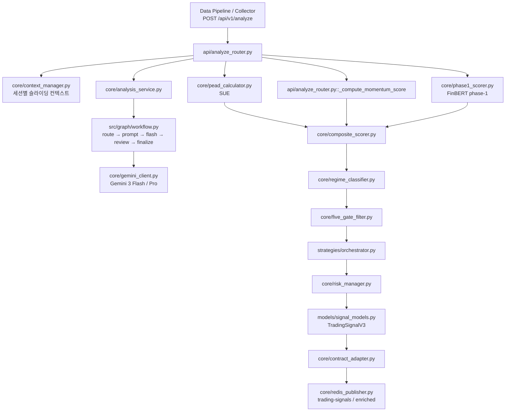

# EarningWhisperer AI Engine v3.5.2

실시간 어닝콜 텍스트를 받아 `phase-1 점수화 → Gemini 분석 → 정량 스코어링 → 5-Gate 필터 → 전략 선택 → Redis 발행`까지 처리하는 FastAPI 기반 AI 엔진입니다.

## 핵심 역할

- 어닝콜 STT 청크를 비동기로 수신
- FinBERT 기반 phase-1 raw score 생성
- Gemini 3.x 라우팅으로 비용을 줄이면서 구조화 분석 수행
- SUE, 모멘텀, 거래량을 합친 composite score 계산
- 5-Gate 규칙으로 실제 매매 가능 신호만 선별
- 최종 신호를 Backend 계약 형식으로 Redis에 발행

## Runtime Flow



## 디렉터리 구조

```text
EarningWhisperer/                   ← 레포 루트
├── ai_engine/                      ← FastAPI 패키지
│   ├── api/
│   │   ├── analyze_router.py
│   │   ├── integration_router.py
│   │   └── research_router.py
│   ├── core/
│   │   ├── analysis_service.py
│   │   ├── backtester.py
│   │   ├── composite_scorer.py
│   │   ├── context_manager.py
│   │   ├── contract_adapter.py
│   │   ├── execution_style.py
│   │   ├── five_gate_filter.py
│   │   ├── gemini_client.py
│   │   ├── integration_state.py
│   │   ├── integrity_validator.py
│   │   ├── llm_consistency.py
│   │   ├── llm_router.py
│   │   ├── pead_calculator.py
│   │   ├── phase1_scorer.py
│   │   ├── prompt_builder.py
│   │   ├── redis_publisher.py
│   │   ├── regime_classifier.py
│   │   ├── risk_manager.py
│   │   ├── score_normalizer.py
│   │   └── token_budgeter.py
│   ├── docs/
│   │   └── (18개 KO 문서 — 아래 문서 섹션 참조)
│   ├── models/
│   │   ├── contract_models.py
│   │   ├── integration_models.py
│   │   ├── request_models.py
│   │   ├── research_models.py
│   │   └── signal_models.py
│   ├── src/graph/
│   │   ├── state.py
│   │   ├── workflow.py
│   │   └── nodes/
│   │       ├── adjudication_llm_call.py
│   │       ├── build_prompt.py
│   │       ├── llm_call.py
│   │       ├── parse_and_finalize.py
│   │       ├── primary_llm_call.py
│   │       ├── review_gate.py
│   │       └── route_decision.py
│   ├── strategies/
│   │   └── orchestrator.py
│   ├── tests/
│   │   ├── test_contract_compatibility.py
│   │   ├── test_core.py
│   │   ├── test_inspection_regressions.py
│   │   ├── test_integration_state.py
│   │   ├── test_llm_routing.py
│   │   ├── test_operational_guards.py
│   │   ├── test_redis_publisher.py
│   │   ├── test_regression_fixes.py
│   │   └── test_research_extensions.py
│   ├── .env.example
│   ├── config.py
│   ├── main.py
│   ├── pytest.ini
│   └── requirements.txt
├── .gitignore
└── README.md
```

## 주요 엔드포인트

| Method | Path | 설명 |
|--------|------|------|
| `POST` | `/api/v1/analyze` | 어닝콜 청크 단건 분석 |
| `POST` | `/api/v1/analyze/batch` | 배치 분석 |
| `POST` | `/api/v1/research/backtest` | 백테스트 실행 |
| `POST` | `/api/v1/research/style` | 실행 스타일 조회 |
| `GET`  | `/health` | 헬스체크 |
| `GET`  | `/stats` | 운영 상태 확인 |

## 실행 방법

### 1. 환경 변수 준비

```bash
cp ai_engine/.env.example ai_engine/.env
# .env 파일을 열어 아래 항목을 채웁니다
```

필수:
- `GEMINI_API_KEY`
- `REDIS_URL`

권장:
- `GEMINI_PRIMARY_MODEL=gemini-3-flash-preview`
- `GEMINI_REVIEW_MODEL=gemini-3-pro-preview`

### 2. 의존성 설치

```bash
pip install -r ai_engine/requirements.txt
```

### 3. 서버 실행

```bash
# 레포 루트(EarningWhisperer/)에서 실행
python -m uvicorn ai_engine.main:app --host 0.0.0.0 --port 8000
```

## 배포 시 체크포인트

- Redis가 실제로 떠 있어야 Backend 계약 신호가 발행됩니다.
- FinBERT 모델 파일은 런타임에 로드됩니다. 오프라인 서버의 경우 `ProsusAI/finbert`를 미리 캐시하거나 로컬 경로로 지정하세요.
- `/stats`에서 `phase1_status`, `gemini_stats`, `redis_connected`를 확인하면 운영 상태를 빠르게 볼 수 있습니다.

## 테스트

```bash
# 레포 루트에서 실행
python -m pytest ai_engine/ -q
```

현재 기준 로컬 검증 결과: `81 passed`

## 문서

| 파일 | 내용 |
|------|------|
| [MODULE_IO_SPEC_KO.md](ai_engine/docs/MODULE_IO_SPEC_KO.md) | 모듈별 입출력 명세 |
| [LLM_IO_SPEC_KO.md](ai_engine/docs/LLM_IO_SPEC_KO.md) | LLM 입출력 명세 |
| [FLOW_SPEC_KO.md](ai_engine/docs/FLOW_SPEC_KO.md) | 전체 플로우 명세 |
| [TECHNICAL_SPEC_TABLE_KO.md](ai_engine/docs/TECHNICAL_SPEC_TABLE_KO.md) | 기술 스펙 테이블 |
| [UPDATE_SUMMARY_3_5_2_KO.md](ai_engine/docs/UPDATE_SUMMARY_3_5_2_KO.md) | v3.5.2 업데이트 내역 |
| [FLOW_AND_STRUCTURE_KO.md](ai_engine/docs/FLOW_AND_STRUCTURE_KO.md) | 구조 및 흐름 요약 |
| [PROJECT_REQUIREMENTS_KO.md](ai_engine/docs/PROJECT_REQUIREMENTS_KO.md) | 프로젝트 요구사항 |
| [GEMINI_3_ROUTING_KO.md](ai_engine/docs/GEMINI_3_ROUTING_KO.md) | Gemini 3 라우팅 전략 |
| [FILE_MANUAL_KO.md](ai_engine/docs/FILE_MANUAL_KO.md) | 파일별 역할 매뉴얼 |
