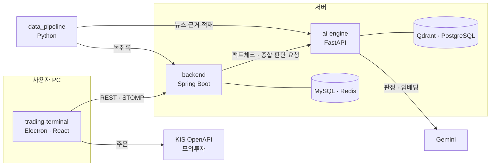

# EarningWhisperer

미국 기업의 어닝콜을 실시간 자막으로 보여 주고, 경영진 발언을 뉴스 근거와 대조하는 어닝콜 분석 데스크톱 앱입니다.

## 소개

어닝콜이 끝나면 주가가 크게 움직이지만 개인 투자자는 콜을 실시간으로 따라가기 어렵습니다. 영어 발언을
듣는 동안 그 말이 사실인지까지 확인하기는 더 어렵습니다. 기관은 이 일을 전용 플랫폼과 분석 인력으로
처리합니다.

EarningWhisperer 는 어닝콜 발언을 문장 단위로 받아 화면에 자막으로 띄웁니다. 발언에 사실 주장이 있으면
수집해 둔 뉴스에서 근거를 찾고, LLM 이 그 근거로 주장을 판정한 결과를 한국어 설명·출처와 함께 붙입니다.
콜이 끝나면 발언 전체를 종합해 방향과 근거를 정리하고, 사용자는 같은 화면에서 등록한 KIS 계좌(모의투자
또는 실전)로 직접 주문할 수 있습니다.

## 주요 기능

| 기능 | 설명 |
|---|---|
| [어닝콜 자막](docs/features/live-transcript.md) | 발언을 발화자와 함께 실시간으로 표시합니다 |
| [실시간 팩트체크](docs/features/fact-check.md) | 세 문장마다 사실 주장을 뽑아 뉴스 근거로 판정하고, 판정 이유를 한국어로 출처와 함께 보여 줍니다 |
| [종합 판단](docs/features/earnings-summary.md) | 콜이 끝나면 강세·약세·중립 판단, 촉매 유형, 리스크, 등급을 정리합니다 |
| 답변 회피 탐지 | 애널리스트 질문의 핵심 주제를 답변이 비켜 갔는지 점수와 누락 주제로 보여 줍니다 |
| 관련 종목 영향 | 공급망·경쟁 관계 종목에 미칠 영향을 방향과 근거로 정리합니다 |
| 손절·익절 계획 | 기준가 대비 손절가와 1·2차 익절가, 보유 기한, 판단을 거둘 조건을 제시합니다 |
| [주문](docs/features/trading.md) | 등록한 KIS 계좌(모의투자 또는 실전)로 사용자가 직접 주문합니다. 설정에서 환경을 바꿀 수 있습니다. 주문은 사용자 PC 에서 바로 나가고 API 키는 OS 키체인에만 저장됩니다 |
| [대시보드와 마켓](docs/features/market.md) | 주요 지수 ETF, 종목 시세, 실적 발표 일정을 보여 줍니다 |

현재 공개 시연은 2026-08-20 월마트(WMT) 실적 발표 어닝콜 녹취록을 재생하는 방식입니다. 재생되는 발언의
팩트체크와 종합 판단은 미리 만든 값이 아니라 ai-engine 이 그때그때 생성합니다. 실제 콜의 음성 인식 경로에는
아직 팩트체크와 종합 판단 호출이 연결되어 있지 않습니다.

## 시스템 구성

```mermaid
flowchart LR
    subgraph PC["사용자 PC"]
        T["trading-terminal<br/>Electron · React"]
    end

    subgraph Server["서버"]
        B["backend<br/>Spring Boot"]
        A["ai-engine<br/>FastAPI"]
        DB[("MySQL · Redis")]
        V[("Qdrant · PostgreSQL")]
    end

    P["data_pipeline<br/>Python"]
    KIS["KIS OpenAPI<br/>모의투자"]
    LLM["Gemini"]

    T -- "REST · STOMP" --> B
    T -- "주문" --> KIS
    B -- "팩트체크 · 종합 판단 요청" --> A
    B --- DB
    A --- V
    A -- "판정 · 임베딩" --> LLM
    P -- "녹취록" --> B
    P -- "뉴스 근거 적재" --> A
```

| 모듈 | 역할 |
|---|---|
| [`trading-terminal`](trading-terminal) | 데스크톱 앱입니다. 자막·팩트체크·종합 판단 화면과 KIS 주문을 맡습니다 |
| [`backend`](backend) | 인증, 어닝콜 세션 관리, 실시간 전달(STOMP), 주문 기록, 시장 데이터 수집을 맡습니다 |
| [`ai-engine`](ai-engine) | 주장 추출, 근거 검색, LLM 판정, 종합 판단을 맡습니다 |
| [`data_pipeline`](data_pipeline) | 웹캐스트 음성 인식(Whisper), 실적 일정·뉴스 수집을 맡습니다 |
| [`infra`](infra) | 시연 서버 배포 스크립트와 docker compose 설정입니다 |

## 시작하기

**앱 사용**: [릴리스 페이지](https://github.com/keonha123/Earning-Whisperer/releases)에서 Windows 설치 파일을
받아 실행합니다. 현재 `v0.1.0-rc1` 은 검증 중인 시험판이며 시연 서버 주소가 설치본에 들어 있습니다.
설치부터 시연 재생까지는 [빠른 시작](docs/overview/quick-start.md)에 정리되어 있습니다.

**개발**: 로컬 실행 방법은 [로컬 개발 환경](docs/developer/setup.md)에, 구조는
[아키텍처](docs/developer/architecture.md)에 있습니다. 서버 배포는 [`infra/DEPLOY.md`](infra/DEPLOY.md)를 참고합니다.

## 문서

전체 문서 목록과 운영 규칙은 [`docs/README.md`](docs/README.md)에 있습니다.

| 문서 | 내용 |
|---|---|
| [빠른 시작](docs/overview/quick-start.md) | 설치, 로그인, 시연 어닝콜 재생 |
| [자주 묻는 질문](docs/overview/faq.md) | 모의투자, API 키 보관, 팩트체크가 나오지 않는 경우 |
| [아키텍처](docs/developer/architecture.md) | 모듈 구성, 주요 흐름, 설계 규칙 |
| [로컬 개발 환경](docs/developer/setup.md) | 모듈별 로컬 실행 |
| [설계 결정 기록](docs/adr/) | STOMP 채택, 터미널 주문 실행, 직접 주문만 지원 등 주요 결정의 배경 |
| [`docs/api-spec.md`](docs/api-spec.md) | 모듈 사이의 API·메시지 계약 |
| [`infra/DEPLOY.md`](infra/DEPLOY.md) | 시연 서버 배포와 운영 |
| [`docs/demo/README.md`](docs/demo/README.md) | 시연 데이터와 팩트체크 정확도 실측 기록 |

## 기여

이슈와 PR 은 [`CONTRIBUTING.md`](CONTRIBUTING.md)의 절차를 따릅니다.

## 팀

| 담당 | GitHub |
|---|---|
| backend, trading-terminal, infra | [@keonha123](https://github.com/keonha123) |
| ai-engine | [@james10419](https://github.com/james10419), [@yytss3](https://github.com/yytss3) |
| data_pipeline | [@dheorb](https://github.com/dheorb) |
