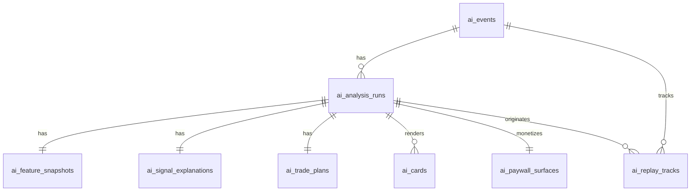
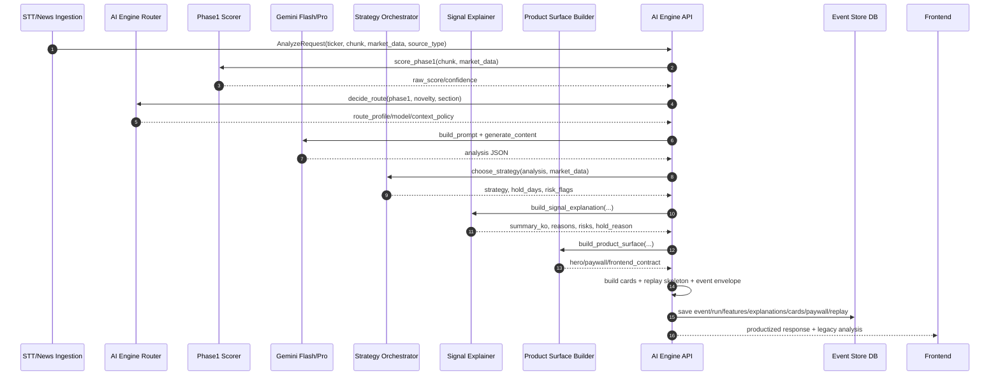
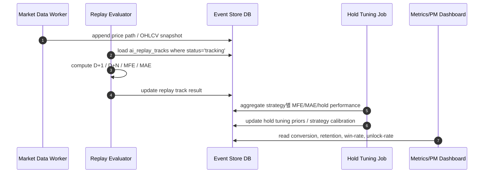
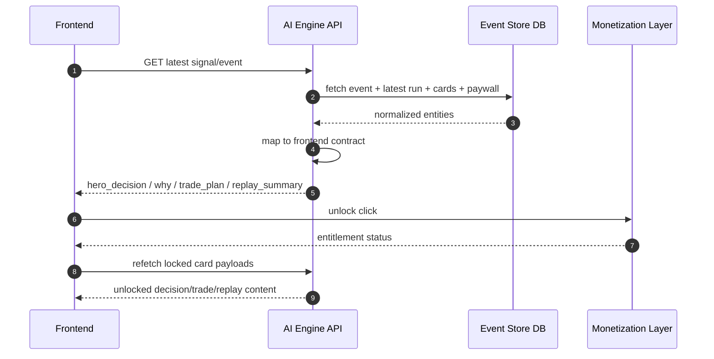

# AI Engine DB 스키마 + 이벤트 플로우 시퀀스 명세

## 1) 목적
이 문서는 EarningWhisperer의 **AI engine 전용 저장 구조**와 **이벤트 처리 흐름**을 정의한다.
범위는 다음으로 제한한다.

- STT/뉴스 원문을 받아 **분석 가능한 chunk/input**를 전달받는 지점부터
- AI engine이 **signal / strategy / explanation / cards / paywall / replay skeleton**을 생성하는 지점까지
- 이후 백엔드가 저장할 수 있는 **event-store 형태의 DB schema**

---

## 2) 저장 단위 설계 원칙

### 핵심 원칙
1. **이벤트 중심 저장**: earnings call / news signal 1건을 `ai_events`로 관리
2. **분석 실행 이력 분리**: 동일 이벤트를 여러 모델/버전으로 재분석 가능
3. **프론트 노출 객체 저장**: card/paywall/replay를 그대로 재생성 가능해야 함
4. **정량 feature 스냅샷 보존**: 추후 리플레이·튜닝·백테스트에 재사용 가능해야 함
5. **멱등성 고려**: `(event_id, run_id, card_type)` 수준으로 unique 제약

---

## 3) 테이블 구조

### A. `ai_events`
이벤트의 루트 엔티티.

| 컬럼 | 타입 | 설명 |
|---|---|---|
| event_id | varchar(64) PK | 엔진 생성 이벤트 ID |
| ticker | varchar(16) | 종목 코드 |
| company_name | varchar(128) | 회사명 |
| source_type | varchar(32) | `earnings_call`, `news` |
| event_type | varchar(32) | `earnings_call`, `guidance_update`, `breaking_news` 등 |
| event_time | timestamptz | 이벤트 기준 시각 |
| market_session | varchar(24) | `pre_market`, `intraday`, `post_market`, `unknown` |
| sector | varchar(64) | 섹터 |
| external_source_id | varchar(128) null | 외부 ingestion/source key |
| chunk_sequence | int | 현재 chunk 번호 |
| is_final_chunk | boolean | 최종 chunk 여부 |
| schema_version | varchar(64) | 엔진 이벤트 스키마 버전 |
| created_at | timestamptz | 생성 시각 |
| updated_at | timestamptz | 수정 시각 |

### B. `ai_analysis_runs`
동일 이벤트에 대한 분석 실행 이력.

| 컬럼 | 타입 | 설명 |
|---|---|---|
| run_id | varchar(64) PK | 분석 실행 ID |
| event_id | varchar(64) FK | `ai_events.event_id` |
| request_id | varchar(64) | API 요청 ID |
| route_profile | varchar(24) | `economy`, `review` |
| model_route | varchar(64) | 실제 사용 모델명 |
| model_version | varchar(64) | 엔진 응답 내 모델 버전 |
| app_version | varchar(32) | AI engine 앱 버전 |
| direction | varchar(16) | `BULLISH/BEARISH/NEUTRAL` |
| magnitude | numeric(8,4) | 신호 강도 |
| confidence | numeric(8,4) | 신뢰도 |
| catalyst_type | varchar(64) | 촉매 타입 |
| rationale | text | 원시 rationale |
| strategy_code | varchar(64) | 선택 전략 코드 |
| strategy_score | numeric(8,4) null | 전략 점수 |
| hold_days | int | 보유기간 |
| review_triggered | boolean | review pass 사용 여부 |
| status | varchar(24) | `ok`, `degraded`, `error` |
| raw_analysis_json | jsonb | 전체 legacy analysis payload |
| created_at | timestamptz | 생성 시각 |

### C. `ai_feature_snapshots`
분석 당시 feature snapshot 저장.

| 컬럼 | 타입 | 설명 |
|---|---|---|
| snapshot_id | bigserial PK | 식별자 |
| run_id | varchar(64) FK | `ai_analysis_runs.run_id` |
| market_snapshot_json | jsonb | gap/surprise/iv/volume/rs 등 |
| topic_deltas_json | jsonb | guidance/demand/margin/capex 변화량 |
| transcript_signals_json | jsonb | management confidence, evasiveness 등 |
| phase1_json | jsonb | phase1 scorer 결과 |
| router_json | jsonb | router 결정 정보 |
| created_at | timestamptz | 생성 시각 |

### D. `ai_signal_explanations`
프론트 친화 요약/이유/리스크 저장.

| 컬럼 | 타입 | 설명 |
|---|---|---|
| explanation_id | bigserial PK | 식별자 |
| run_id | varchar(64) FK | `ai_analysis_runs.run_id` |
| display_text | text | 사용자 표시 문장 |
| summary_ko | text | 한국어 요약 |
| reasons_json | jsonb | 핵심 근거 배열 |
| risks_json | jsonb | 리스크 배열 |
| counter_scenario | text | 반대 시나리오 |
| hold_period_reason | text | 보유기간 이유 |
| created_at | timestamptz | 생성 시각 |

### E. `ai_trade_plans`
전략 실행 힌트 저장.

| 컬럼 | 타입 | 설명 |
|---|---|---|
| plan_id | bigserial PK | 식별자 |
| run_id | varchar(64) FK | `ai_analysis_runs.run_id` |
| strategy | varchar(64) | 전략 코드 |
| strategy_label_ko | varchar(128) | 전략 한국어명 |
| entry_style | varchar(64) | 엔트리 스타일 코드 |
| entry_style_label_ko | varchar(128) | 엔트리 스타일 한국어명 |
| entry_zone | varchar(64) null | 진입 구간 |
| stop_loss | numeric(18,6) null | 손절 기준 |
| take_profit_1 | numeric(18,6) null | 1차 목표 |
| take_profit_2 | numeric(18,6) null | 2차 목표 |
| invalidation | text | 무효화 조건 |
| time_stop | varchar(64) | time stop 텍스트 |
| positioning_note | text | 포지셔닝 설명 |
| raw_trade_plan_json | jsonb | 원본 trade plan |
| created_at | timestamptz | 생성 시각 |

### F. `ai_cards`
프론트 카드 렌더용 저장.

| 컬럼 | 타입 | 설명 |
|---|---|---|
| card_id | varchar(96) PK | 카드 ID |
| run_id | varchar(64) FK | `ai_analysis_runs.run_id` |
| event_id | varchar(64) FK | `ai_events.event_id` |
| card_type | varchar(32) | `hero_decision`, `why`, `trade_plan`, `risk_warning`, `unlock_offer`, `replay_summary` |
| priority | int | 표시 우선순위 |
| visible | boolean | 노출 여부 |
| locked | boolean | 잠금 여부 |
| payload_json | jsonb | 카드 payload |
| lock_context_json | jsonb null | paywall 메시지 |
| created_at | timestamptz | 생성 시각 |

### G. `ai_paywall_surfaces`
수익화 surface 정보 저장.

| 컬럼 | 타입 | 설명 |
|---|---|---|
| paywall_id | bigserial PK | 식별자 |
| run_id | varchar(64) FK | `ai_analysis_runs.run_id` |
| primary_surface_code | varchar(64) | 주 surface |
| primary_surface_json | jsonb | 주 surface 상세 |
| secondary_surfaces_json | jsonb | 보조 surface 목록 |
| unlock_cards_json | jsonb | unlock 대상 카드 목록 |
| frontend_contract_json | jsonb | 프론트 계약 포맷 |
| summary | text | paywall summary |
| created_at | timestamptz | 생성 시각 |

### H. `ai_replay_tracks`
사후 성과 추적용 skeleton.

| 컬럼 | 타입 | 설명 |
|---|---|---|
| replay_id | bigserial PK | 식별자 |
| run_id | varchar(64) FK | `ai_analysis_runs.run_id` |
| event_id | varchar(64) FK | `ai_events.event_id` |
| status | varchar(24) | `tracking`, `closed`, `cancelled` |
| original_signal_json | jsonb | 원 시그널 |
| milestones_json | jsonb | D+1, D+N milestone |
| expected_path | text | 기대 경로 |
| exit_watch | text | exit watch 문구 |
| realized_pnl_pct | numeric(10,4) null | 사후 성과 |
| mfe_pct | numeric(10,4) null | 최대 유리 변동 |
| mae_pct | numeric(10,4) null | 최대 불리 변동 |
| close_reason | varchar(64) null | 종료 사유 |
| created_at | timestamptz | 생성 시각 |
| updated_at | timestamptz | 수정 시각 |

---

## 4) 권장 인덱스

```sql
create index idx_ai_events_ticker_time on ai_events (ticker, event_time desc);
create index idx_ai_analysis_runs_event_time on ai_analysis_runs (event_id, created_at desc);
create index idx_ai_analysis_runs_strategy on ai_analysis_runs (strategy_code, created_at desc);
create index idx_ai_cards_run_priority on ai_cards (run_id, priority asc);
create index idx_ai_replay_tracks_event on ai_replay_tracks (event_id, created_at desc);
create index idx_ai_replay_tracks_status on ai_replay_tracks (status, updated_at desc);
```

---

## 5) 권장 ER 관계



---

## 6) 이벤트 플로우 시퀀스 다이어그램

### 6-1. 실시간 분석 생성 플로우



### 6-2. 리플레이/성과 추적 플로우



### 6-3. 프론트 렌더 플로우



---

## 7) 응답-DB 매핑 규칙

| API 응답 경로 | 저장 위치 |
|---|---|
| `data.event.*` | `ai_events` |
| `data.market_snapshot` | `ai_feature_snapshots.market_snapshot_json` |
| `data.analysis.*` | `ai_analysis_runs`, `ai_signal_explanations` |
| `data.analysis.topic_deltas` | `ai_feature_snapshots.topic_deltas_json` |
| `data.cards[]` | `ai_cards` |
| `data.paywall.*` | `ai_paywall_surfaces` |
| `data.replay.*` | `ai_replay_tracks` |
| top-level `analysis` | `ai_analysis_runs.raw_analysis_json` |

---

## 8) 운영 메모

### 필수 저장
- event
- latest analysis run
- signal explanation
- cards
- paywall
- replay skeleton

### 권장 저장
- full prompt hash
- model raw response hash
- latency metrics
- entitlement exposure / unlock conversion

### 추후 확장
- per-user personalization layer
- strategy marketplace / creator attribution
- broker/execution partner revenue split ledger
- replay grade / trust score / badge history

