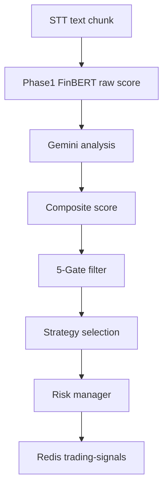
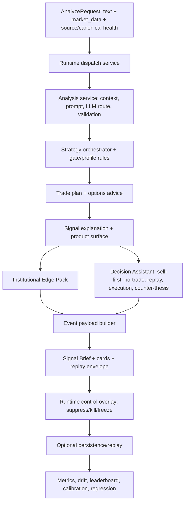

# AI Engine v3.5.2 원본 대비 v9.5.8 변경 명세

## 1. 문서 목적

이 문서는 원본 GitHub repo [`keonha123/Earning-Whisperer`](https://github.com/keonha123/Earning-Whisperer)의 AI engine 설계와 현재 정리된 `EarningWhisperer v9.5.8 GitHub-ready` AI engine의 차이를 설명한다.

비교 기준:

- 원본 repo README: 실시간 어닝콜 AI 스트리밍 분석 및 모의 매매 시스템
- 원본 `ai-engine/README.md`: `v3.5.2` FastAPI AI engine
- 원본 `docs/api-spec.md`: Data Pipeline, AI Engine, Backend, Trading Terminal 간 계약
- 현재 로컬 패키지: `EarningWhisperer_v9_5_8_github_ready`

## 2. 한 줄 요약

원본 v3.5.2는 `실시간 STT 청크를 감성 점수와 Redis 신호로 바꾸는 엔진`에 가깝다. v9.5.8은 이를 `검증, 운영 제어, 설명 가능성, 실행비용, no-trade 판단, replay evidence까지 포함하는 AI-engine-only 의사결정 엔진`으로 재구성했다.

## 3. 핵심 차이 요약

| 구분 | 원본 v3.5.2 AI engine | 현재 v9.5.8 AI engine |
|---|---|---|
| 제품 범위 | 전체 서비스 중 AI 분석 모듈. Backend/Terminal/Frontend와 강하게 연결 | AI-engine-only 독립 서비스. Backend, UI, broker execution은 범위 밖 |
| 주 입력 | `ticker`, `text_chunk`, `sequence`, `timestamp`, `is_final` 중심 | `AnalyzeRequest`: `ticker`, `prompt/current_chunk`, `market_data`, `section_type`, `source_type`, `canonical_bundle`, `source_health`, `universe_profile` |
| 주 출력 | Redis `trading-signals`: `ticker`, `raw_score`, `rationale`, `text_chunk`, `timestamp` | Productized response envelope: `signal_brief`, `data.analysis`, `cards`, `paywall`, `replay`, persistence envelope |
| 주요 흐름 | Phase1 FinBERT -> Gemini -> composite -> 5-Gate -> strategy -> Redis | canonical/source health -> LLM routing -> strategy -> enrichment -> product surface -> decision assistant -> control overlay -> persist/replay |
| 전략 검증 | `/api/v1/research/backtest` 수준 | proxy/replay/hybrid backtest, regression compare, calibration proposal, leaderboard, drift, scorecard |
| 운영 제어 | 5-Gate 및 Redis 발행 중심 | gate patch, approve/reject/apply/rollback, rollout, emergency state, shadow compare, auto-promotion |
| 설명 가능성 | `rationale`, 일부 LLM 해설 | `signal_brief`, feature/risk drivers, gate/block reasons, institutional edge, counter-thesis, frontend cards |
| 매수/매도 판단 | BUY/SELL/HOLD 중심 | `ADD/HOLD/REDUCE/EXIT/AVOID`, no-trade explainer, execution badge, replay confidence badge |
| 실주문 | 원본 전체 설계상 Terminal이 KIS 호출 가능 | v9.5.8 AI engine은 주문 실행 안 함. `order_draft_preview`만 제공 |
| 비용/토큰 | Gemini route 비용 절감 지향 | route별 prompt budget, token usage, cache/coalescing stats, estimated cost telemetry |

## 4. 원본 AI engine의 목표와 구조

원본 GitHub 문서 기준 목표는 다음이다.

- 개인 투자자에게 실시간 어닝콜 AI 분석 제공
- 실시간 NLP 점수화로 정보 비대칭 완화
- FinBERT 기반 빠른 raw score와 LLM rationale 결합
- composite score와 5-Gate 필터로 매매 가능 신호 선별
- Redis Pub/Sub으로 Backend에 신호 발행
- 전체 시스템에서는 Java Backend, WebSocket, Trading Terminal, KIS API를 통해 모의/실행 흐름까지 연결

원본 AI engine runtime flow:

```text
Data Pipeline / Collector
-> POST /api/v1/analyze
-> context manager
-> Phase1 FinBERT raw score
-> Gemini structured analysis
-> SUE / momentum / volume composite score
-> regime classifier
-> 5-Gate filter
-> strategy orchestrator
-> risk manager
-> TradingSignalV3
-> contract adapter
-> Redis publisher
```

원본 핵심 API:

| Method | Path | 용도 |
|---|---|---|
| POST | `/api/v1/analyze` | 어닝콜 청크 단건 분석 |
| POST | `/api/v1/analyze/batch` | 배치 분석 |
| POST | `/api/v1/research/backtest` | 백테스트 실행 |
| POST | `/api/v1/research/style` | 실행 스타일 조회 |
| GET | `/health` | 헬스체크 |
| GET | `/stats` | 운영 상태 |

## 5. v9.5.8에서 추가한 주요 내용

### 5.1 AI-engine-only 경계 재정의

현재 버전은 Backend, Frontend, Trading Terminal, 인증, 결제, broker order execution을 직접 포함하지 않는다. 대신 AI engine이 다음을 책임진다.

- 이벤트 기반 신호 생성
- 설명 가능한 판단 payload 생성
- 운영 제어와 회귀 검증
- 전략별 연구/검증 artifact 생성
- 주문 실행 전 단계의 advisory-only 판단과 주문 초안 제공

이 결정은 시스템을 더 명확하게 만든다. AI engine이 주문 실행까지 직접 책임지면 규제, 인증, 계좌 상태, broker 장애까지 한 서비스에 섞인다. v9.5.8은 실제 주문 실행을 분리하고, 대신 `order_draft_preview`와 `execution_badge`로 UI/Terminal이 사용할 판단 재료를 제공한다.

### 5.2 Productized Signal Brief

기존 `raw_score/rationale` 중심 응답을 프론트와 운영 시스템이 바로 쓸 수 있는 `signal_brief`로 확장했다.

핵심 필드:

- `action`
- `confidence`
- `summary_ko`
- `key_reasons_ko`
- `risk_flags_ko`
- `recommended_hold_days`
- `gate_result`
- `strategy_id`
- `institutional_grade`
- `institutional_approval_state`
- `sell_first_action`
- `recommended_change_pct`
- `position_intent_ko`
- `no_trade_summary_ko`
- `replay_confidence_badge`
- `execution_badge`
- `counter_thesis_ko`

### 5.3 Decision Assistant

v9.5.8의 가장 큰 제품 차별화 레이어다.

위치:

- `core/decision_assistant.py`
- `metadata.decision_assistant`
- `metadata.product_surface.decision_assistant`
- `data.analysis.decision_assistant`
- `data.cards[].card_type == "decision_assistant"`

제공 기능:

- `sell_first`: `ADD`, `HOLD`, `REDUCE`, `EXIT`, `AVOID`
- `no_trade_explainer`: 왜 매수/매도하면 안 되는지
- `replay_confidence_badge`: 검증된 전략/유니버스인지
- `execution_badge`: spread, latency, round-trip cost 반영
- `counter_thesis`: 반대 논리와 view가 깨지는 조건
- `portfolio_impact_map`: 섹터, 시총, SPY/QQQ beta, 상대강도 영향
- `order_draft_preview`: broker API 호출 없는 주문 초안

기존 증권사 AI 기능은 뉴스 요약, 공시 요약, 번역, 이벤트 설명에 머무르는 경우가 많다. 이 레이어는 "왜 사면 안 되는지", "체결비용 때문에 진입 금지인지", "과거 replay evidence가 있는지"까지 말한다는 점이 다르다.

### 5.4 Institutional Edge Pack

기관급 실행 검토를 위한 품질 계층을 추가했다.

평가 축:

- `evidence_quality`
- `execution_feasibility`
- `risk_control`
- `edge_distinctiveness`
- `capacity`
- `red_team`
- `moat_vs_retail_ai`

목적은 retail summary가 아니라 "이 신호가 실행 검토 대상인가"를 판단하는 것이다.

### 5.5 Control Plane

원본은 5-Gate 이후 Redis 발행 중심이었다. 현재는 gate 변경과 운영 제어를 별도 API로 분리했다.

추가된 제어:

- gate patch create/list/approve/reject/apply/rollback
- audit trail
- rollout create/list/get/advance/abort
- emergency state
- shadow compare
- auto-promotion evaluation

핵심 목적:

- 운영 중 gate 변경 이력 보존
- candidate patch를 바로 prod에 반영하지 않고 replay/regression 후 승격
- kill switch 또는 suppress 상태에서 신규 실행 차단

### 5.6 Calibration / Regression / Replay

전략 성능 검증 계층을 추가했다.

- proxy/replay/hybrid backtest
- Nasdaq100/SP500 universe files
- strategy/risk-style별 결과 분리
- timestamp-sorted MDD
- net return 기준 win-rate
- Wilson lower bound
- Bayesian win-rate mean
- fractional Kelly
- execution stress validation
- regression diff report
- calibration proposal

검증 예시:

- Nasdaq100 conservative v9.5.7 artifact
- `43` trades
- `62.7907%` win rate
- `47.8595%` Wilson lower-bound win rate
- `2.2955` Sharpe
- `-11.4037%` MDD

주의: 이 값은 broad-universe proxy backtest 결과이며, 실제 closed replay sample과 분리해서 해석해야 한다.

## 6. 현재 API 명세

### 6.1 Health / Stats

| Method | Path | 설명 |
|---|---|---|
| GET | `/health` | 기본 상태 |
| GET | `/health/live` | 프로세스 liveness |
| GET | `/health/ready` | DB/서비스 readiness |
| GET | `/stats` | route, token, cost, source health, control stats |

### 6.2 Signal Generation

| Method | Path | 설명 |
|---|---|---|
| POST | `/v1/engine/analyze` | v9 표준 분석 |
| POST | `/analyze` | legacy-compatible analyze alias |
| POST | `/v1/engine/events/persist` | 분석 envelope 저장 |
| POST | `/v1/engine/analyze-and-persist` | 분석 후 저장 |

### 6.3 Query / Replay / Metrics

| Method | Path | 설명 |
|---|---|---|
| GET | `/v1/engine/runs` | run 목록 |
| GET | `/v1/engine/runs/{run_id}` | run bundle |
| GET | `/v1/engine/events/{event_id}` | event bundle |
| PATCH | `/v1/engine/replay/{run_id}` | replay 결과 close/update |
| GET | `/v1/engine/metrics/overview` | 전체 메트릭 |
| GET | `/v1/engine/metrics/scorecard` | 품질 scorecard |
| GET | `/v1/engine/metrics/drift` | drift |
| GET | `/v1/engine/metrics/leaderboard` | strategy leaderboard |

### 6.4 Control Plane

| Method | Path | 설명 |
|---|---|---|
| POST | `/v1/engine/controls/gate-patches` | gate patch 생성 |
| GET | `/v1/engine/controls/gate-patches` | patch 목록 |
| POST | `/v1/engine/controls/gate-patches/{patch_id}/approve` | 승인 |
| POST | `/v1/engine/controls/gate-patches/{patch_id}/reject` | 거절 |
| GET | `/v1/engine/controls/gate-patches/{patch_id}/audit` | 감사 이력 |
| POST | `/v1/engine/controls/gate-patches/{patch_id}/apply` | 적용 |
| POST | `/v1/engine/controls/gate-configs/{strategy_code}/rollback` | rollback |
| POST | `/v1/engine/controls/gate-patches/{patch_id}/rollouts` | rollout 생성 |
| GET | `/v1/engine/controls/rollouts` | rollout 목록 |
| POST | `/v1/engine/controls/rollouts/{rollout_id}/advance` | 단계 승격 |
| POST | `/v1/engine/controls/rollouts/{rollout_id}/abort` | 중단 |
| GET | `/v1/engine/controls/emergency-state` | emergency state 조회 |
| POST | `/v1/engine/controls/emergency-state` | emergency state 설정 |
| POST | `/v1/engine/controls/gate-patches/shadow-compare` | 후보 patch shadow 비교 |
| POST | `/v1/engine/controls/gate-patches/auto-promotion/evaluate` | auto-promotion 평가 |

### 6.5 Calibration / Regression

| Method | Path | 설명 |
|---|---|---|
| POST | `/v1/engine/calibration/run` | calibration proposal 생성 |
| GET | `/v1/engine/calibration/proposals` | proposal 목록 |
| GET | `/v1/engine/calibration/proposals/{proposal_id}` | proposal 상세 |
| POST | `/v1/engine/calibration/proposals/{proposal_id}/promote` | proposal 승격 |
| POST | `/v1/engine/regression/compare` | baseline vs candidate 비교 |
| GET | `/v1/engine/regression/reports` | report 목록 |
| GET | `/v1/engine/regression/reports/{report_id}` | report 상세 |

## 7. Analyze 입력 명세

현재 `AnalyzeRequest` 주요 입력:

```json
{
  "ticker": "NVDA",
  "prompt": "Revenue beat, guidance raised, demand remains strong.",
  "market_data": {
    "ticker": "NVDA",
    "current_price": 950.0,
    "prev_close": 910.0,
    "volume_ratio": 2.6,
    "vix": 18.0,
    "gap_pct": 4.2,
    "iv_rank": 71.0,
    "implied_move_pct": 5.5,
    "bid_ask_spread_bps": 10.0,
    "relative_strength_20d": 8.1,
    "sector_momentum": 0.5,
    "surprise_pct": 11.4,
    "rsi_14": 63.0,
    "macd_signal": 0.4,
    "liquidity_score": 0.92,
    "ma20": 930.0,
    "ma50": 900.0,
    "ma200": 780.0,
    "bb_position": 0.68,
    "stochastic_k": 72.0,
    "stochastic_d": 68.0,
    "ichimoku_weekly_cloud_bias": "bullish",
    "spy_relative_strength_20d": 1.2,
    "qqq_relative_strength_20d": 2.4,
    "beta_spy_60d": 1.1,
    "beta_qqq_60d": 1.2,
    "zero_dte_available": true,
    "zero_dte_put_call_volume_ratio": 0.8,
    "revenue_growth_yoy": 24.0,
    "earnings_growth_yoy": 31.0,
    "gross_margin": 72.0,
    "debt_to_equity": 0.3,
    "market_cap_bucket": "mega",
    "sector_code": "semiconductors"
  },
  "section_type": "GUIDANCE",
  "source_type": "EARNINGS_CALL",
  "chunk_sequence": 2,
  "request_priority": 5,
  "is_final": false,
  "route_profile": "standard",
  "needs_review": false,
  "universe_profile": "NASDAQ100",
  "canonical_bundle": null,
  "source_health": []
}
```

원본 대비 추가된 대표 입력:

- `market_data` 확장: VIX, gap, IV, bid/ask spread, liquidity, MA, Bollinger, stochastic, weekly Ichimoku, 0DTE, fundamentals, QQQ/SPY beta
- `source_type`: earnings/news/social/filing 분리
- `section_type`: prepared/Q&A/guidance 구분
- `canonical_bundle`: 정규화 이벤트/회사/가이던스 번들
- `source_health`: 소스별 freshness와 degradation 추적
- `universe_profile`: Nasdaq100/SP500/risk-style 전략 분기

## 8. Analyze 출력 명세

현재 응답은 단일 raw signal이 아니라 productized envelope이다.

주요 구조:

```json
{
  "request_id": "req_nvda_20260503T000000Z_002",
  "timestamp": "2026-05-03T00:00:00Z",
  "status": "ok",
  "schema_version": "2026-04-19.ai-engine-event-v1",
  "signal_brief": {
    "action": "BUY",
    "confidence": 0.89,
    "summary_ko": "상방 지속 가능성이 높은 Long 후보입니다.",
    "key_reasons_ko": ["가이던스 상향", "AI 수요 강화"],
    "risk_flags_ko": ["초반 갭 메우기 가능성"],
    "recommended_hold_days": 4,
    "gate_result": "pass",
    "strategy_id": "PEAD",
    "sell_first_action": "ADD",
    "recommended_change_pct": 20.0,
    "position_intent_ko": "보유 중이면 제한적으로 증액, 신규 진입은 분할 매수 우선",
    "no_trade_summary_ko": "현재는 신규 진입 차단 사유가 우세하지 않습니다.",
    "replay_confidence_badge": {
      "available": true,
      "label": "검증 우수",
      "sample_count": 43
    },
    "execution_badge": {
      "label": "실행 가능",
      "estimated_all_in_cost_pct": 0.45,
      "limit_pct": 0.55
    },
    "counter_thesis_ko": "강세 시나리오의 반대 논리는 호재가 이미 가격에 반영되는 경우입니다."
  },
  "data": {
    "event": {},
    "market_snapshot": {},
    "analysis": {
      "direction": "BULLISH",
      "strategy_decision": {},
      "signal_explanation": {},
      "feature_bundle": {},
      "signal_data_hub": {},
      "institutional_edge": {},
      "decision_assistant": {}
    },
    "cards": [
      {"card_type": "hero_decision"},
      {"card_type": "why"},
      {"card_type": "trade_plan"},
      {"card_type": "decision_assistant"},
      {"card_type": "institutional_edge"},
      {"card_type": "replay_summary"}
    ],
    "paywall": {},
    "replay": {}
  }
}
```

원본 대비 추가된 대표 출력:

- `signal_brief`: 고정된 요약 계약
- `data.cards`: 프론트 카드 단위 출력
- `decision_assistant`: buy/sell/no-trade 판단
- `institutional_edge`: 기관급 실행 검토 점수
- `replay`: 신호 추적/검증 상태
- `feature_bundle`, `signal_data_hub`: canonical/source health/TTL/cache telemetry

## 9. 전체 로직과 Flow 변화

### 9.1 원본 flow



### 9.2 현재 v9.5.8 flow



핵심 변화:

- 단순 감성 점수 발행에서 "판단 가능한 제품 payload"로 전환
- LLM 결과를 그대로 믿지 않고 deterministic post-processing 계층을 둠
- 전략 검증과 운영 제어가 runtime API와 분리됨
- 실제 주문 실행 대신 advisory output과 execution feasibility를 제공

## 10. 추가한 로직과 알고리즘

| 로직 | 목적 |
|---|---|
| Source health / canonical bundle | 입력 출처 신뢰도와 freshness 추적 |
| Token budgeter | route별 prompt budget과 비용 관리 |
| Signal data hub | feature/source topic TTL, cache hit, coalescing telemetry |
| Strategy profiles | Nasdaq100/SP500, conservative/aggressive 전략 집합 분리 |
| Execution cost blocker | spread + latency + round-trip cost가 한도를 넘으면 진입 금지 |
| Timestamp-sorted MDD | 백테스트 MDD 계산 오류 방지 |
| Wilson lower bound | 작은 표본 승률 과대평가 방지 |
| Bayesian win-rate mean | 승률 추정 안정화 |
| Fractional Kelly diagnostic | 포지션 크기 판단 보조 |
| Institutional Edge Pack | 기관급 실행 검토 품질 점수 |
| Decision Assistant | 매수/보유/축소/청산/회피를 설명 가능한 payload로 변환 |
| No-trade explainer | 왜 매수 금지인지 명시 |
| Counter-thesis | 반대 논리와 invalidation 조건 제시 |
| Regression compare | patch 적용 전/후 성과 diff |
| Calibration proposal | active patch 직접 변경 없이 개선 후보 생성 |

## 11. 무엇을 더 추가했는가

v9.5.8 기준 추가된 주요 파일/모듈:

- `core/decision_assistant.py`
- `core/institutional_edge.py`
- `core/signal_brief.py`
- `core/event_payload_builder.py`
- `core/signal_data_hub.py`
- `core/quant_risk_math.py`
- `services/control_plane_service.py`
- `services/research_backtest_service.py`
- `services/runtime_dispatch_service.py`
- `repositories/event_store_repository.py`
- `tools/market_interest_backtest.py`
- `tools/execution_stress_validate.py`
- `docs/DECISION_ASSISTANT_PRODUCT_LAYER.md`
- `docs/MIT_QUANT_BIBLE_APPLICATION.md`
- `docs/OPERATION_READINESS_VALIDATION.md`
- `docs/NASDAQ100_CONSERVATIVE_SLEEVE_GOVERNOR.md`

테스트도 원본 `81 passed` 수준에서 현재 `133 passed`로 확장됐다.

## 12. 레거시 프로그램/증권사 AI 기능과의 차이

| 비교 대상 | 일반적 기능 | v9.5.8 차별점 |
|---|---|---|
| 증권사 AI 뉴스 요약 | 뉴스/공시/어닝콜 요약, 번역 | 요약 후 실제 진입 가능성, 비용, no-trade 사유까지 판단 |
| 토스증권류 AI 기능 | 쉬운 설명, 실시간 이벤트 해석, 종목 정보 전달 | replay confidence, execution badge, counter-thesis, sell-first action |
| 전통 HTS/MTS | 차트, 재무제표, 수급 지표 제공 | 지표를 독립 제공하지 않고 전략/gate/portfolio impact에 연결 |
| 유튜브/커뮤니티 해설 | 사람의 주관적 해석 | deterministic gates, source health, regression/replay evidence |
| 단순 퀀트 백테스터 | 가격 기반 백테스트 | 이벤트/어닝/뉴스 proxy + actual replay 분리, 운영 patch 승격 흐름 |
| 자동매매 봇 | 신호가 나오면 주문 | AI engine은 주문하지 않고 advisory/order draft만 제공해 책임 경계를 명확화 |

핵심 차별점은 다음이다.

- "왜 사야 하는가"보다 "왜 사면 안 되는가"를 먼저 설명
- LLM 답변을 그대로 쓰지 않고 검증/게이트/비용/리스크 레이어를 통과시킴
- replay/backtest evidence를 신호 confidence와 분리
- UI 카드가 바로 쓸 수 있는 구조화 payload 제공
- 운영 중 gate 변경과 patch 승격을 감사 가능하게 관리

## 13. 주요 목표 변화

원본 목표:

- 개인 투자자에게 실시간 어닝콜 NLP 분석 제공
- 정보 비대칭 완화
- 모의/자동매매 시스템의 신호 생성

현재 목표:

- AI engine을 독립적이고 검증 가능한 의사결정 엔진으로 강화
- 실시간 신호뿐 아니라 운영 제어, 검증, 회귀, 설명 가능성을 포함
- 실제 주문 실행보다 "실행 가능한가/하면 안 되는가/근거가 검증됐는가"를 먼저 판단
- 증권사 AI 요약 기능보다 깊은 trading decision intelligence 제공

## 14. 남아 있는 확장 후보

현재 v9.5.8은 AI engine 범위에서는 상당 부분 product-grade에 가까워졌지만, 실제 운영 제품으로 가려면 아래가 추가되면 좋다.

- 실제 closed replay corpus 축적
- KIS/브로커 계좌 상태와 별도 Execution Gateway 연결
- 실시간 portfolio concentration service
- live quote/order book 기반 spread/impact 추정
- per-user suitability/risk policy layer
- source adapter productionization: Benzinga, X, YouTube, filings, newswire
- monitored canary rollout automation
- dashboard UI for signal brief, no-trade explainer, replay evidence, and patch audit

## 15. 참고 출처

- 원본 repo: [keonha123/Earning-Whisperer](https://github.com/keonha123/Earning-Whisperer)
- 원본 AI engine README: [ai-engine/README.md](https://github.com/keonha123/Earning-Whisperer/blob/main/ai-engine/README.md)
- 원본 API spec: [docs/api-spec.md](https://github.com/keonha123/Earning-Whisperer/blob/main/docs/api-spec.md)
- 원본 project proposal: [docs/project-proposal.md](https://github.com/keonha123/Earning-Whisperer/blob/main/docs/project-proposal.md)
- 현재 문서: `README.md`, `CHANGELOG.md`, `docs/DECISION_ASSISTANT_PRODUCT_LAYER.md`, `docs/OPERATION_READINESS_VALIDATION.md`, `docs/MIT_QUANT_BIBLE_APPLICATION.md`
