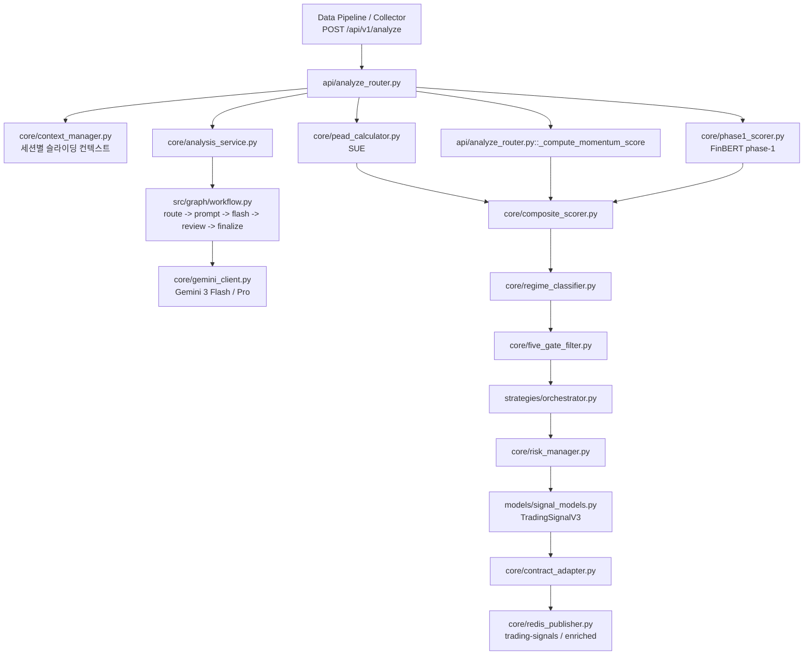

# EarningWhisperer AI Engine v3.5.2

실시간 어닝콜 텍스트를 받아 `phase-1 점수화 -> Gemini 분석 -> 정량 스코어링 -> 5-Gate 필터 -> 전략 선택 -> Redis 발행`까지 처리하는 FastAPI 기반 AI 엔진입니다.

## 핵심 역할

- 어닝콜 STT 청크를 비동기로 수신
- FinBERT 기반 phase-1 raw score 생성
- Gemini 3.x 라우팅으로 비용을 줄이면서 구조화 분석 수행
- SUE, 모멘텀, 거래량을 합친 composite score 계산
- 5-Gate 규칙으로 실제 매매 가능 신호만 선별
- 최종 신호를 Backend 계약 형식으로 Redis에 발행

## Runtime Flow



## 디렉터리 구조

```text
ai_engine/
├── api/
│   ├── analyze_router.py
│   ├── integration_router.py
│   └── research_router.py
├── core/
│   ├── analysis_service.py
│   ├── backtester.py
│   ├── composite_scorer.py
│   ├── context_manager.py
│   ├── contract_adapter.py
│   ├── five_gate_filter.py
│   ├── gemini_client.py
│   ├── integrity_validator.py
│   ├── llm_consistency.py
│   ├── llm_router.py
│   ├── pead_calculator.py
│   ├── phase1_scorer.py
│   ├── prompt_builder.py
│   ├── redis_publisher.py
│   ├── regime_classifier.py
│   ├── risk_manager.py
│   └── score_normalizer.py
├── docs/
│   ├── FLOW_AND_STRUCTURE_KO.md
│   ├── GEMINI_3_ROUTING_KO.md
│   └── ...
├── models/
│   ├── contract_models.py
│   ├── request_models.py
│   ├── research_models.py
│   └── signal_models.py
├── src/graph/
│   ├── workflow.py
│   ├── state.py
│   └── nodes/
├── strategies/
│   └── orchestrator.py
├── tests/
├── .env.example
├── config.py
├── main.py
├── pytest.ini
└── requirements.txt
```

## 주요 엔드포인트

- `POST /api/v1/analyze`
- `POST /api/v1/analyze/batch`
- `POST /api/v1/research/backtest`
- `POST /api/v1/research/style`
- `GET /health`
- `GET /stats`

## 실행 방법

### 1. 환경 변수 준비

`.env.example`을 복사해 `.env`를 만들고 최소값을 채웁니다.

필수:
- `GEMINI_API_KEY`
- `REDIS_URL`

권장:
- `GEMINI_PRIMARY_MODEL=gemini-3-flash-preview`
- `GEMINI_REVIEW_MODEL=gemini-3-pro-preview`

### 2. 의존성 설치

```powershell
cd C:\Users\james\source\repos\files2_work\source\earning_whisperer\ai_engine
pip install -r requirements.txt
```

### 3. 서버 실행

```powershell
cd C:\Users\james\source\repos\files2_work\source\earning_whisperer
python -m uvicorn ai_engine.main:app --host 0.0.0.0 --port 8000
```

## 배포 시 체크포인트

- Redis가 실제로 떠 있어야 Backend 계약 신호가 발행됩니다.
- FinBERT는 코드에 포함되어 있지만 모델 파일은 런타임에 로드됩니다.
- 오프라인 서버면 `ProsusAI/finbert`를 미리 캐시하거나 로컬 경로로 지정하는 편이 안전합니다.
- `/stats`에서 `phase1_status`, `gemini_stats`, `redis_connected`를 확인하면 운영 상태를 빠르게 볼 수 있습니다.

## 테스트

```powershell
cd C:\Users\james\source\repos\files2_work\source\earning_whisperer\ai_engine
python -m pytest -q
```

현재 기준 로컬 검증 결과:
- `81 passed`

## 문서

- [MODULE_IO_SPEC_KO.md](docs/MODULE_IO_SPEC_KO.md)
- [LLM_IO_SPEC_KO.md](docs/LLM_IO_SPEC_KO.md)
- [FLOW_SPEC_KO.md](docs/FLOW_SPEC_KO.md)
- [TECHNICAL_SPEC_TABLE_KO.md](docs/TECHNICAL_SPEC_TABLE_KO.md)
- [UPDATE_SUMMARY_3_5_2_KO.md](docs/UPDATE_SUMMARY_3_5_2_KO.md)
- [FLOW_AND_STRUCTURE_KO.md](docs/FLOW_AND_STRUCTURE_KO.md)
- [PROJECT_REQUIREMENTS_KO.md](docs/PROJECT_REQUIREMENTS_KO.md)
- [GEMINI_3_ROUTING_KO.md](docs/GEMINI_3_ROUTING_KO.md)
- [FILE_MANUAL_KO.md](docs/FILE_MANUAL_KO.md)
