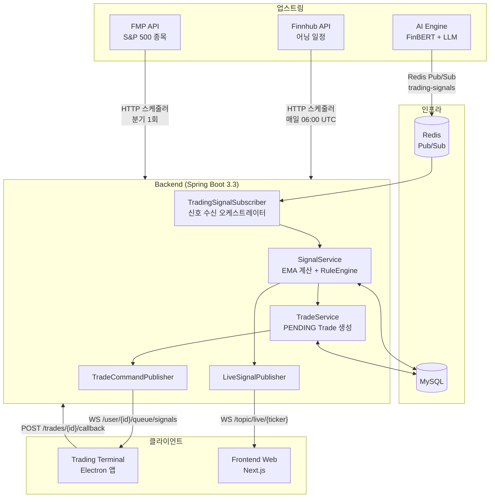

# EarningWhisperer — Backend


AI 시그널을 수신하여 EMA 계산 → 룰엔진 판단 → Trading Terminal로 매매 명령 라우팅 → 체결 콜백 수신 → 웹 대시보드 브로드캐스팅을 담당하는 중앙 관제탑(Control Tower)입니다.

> **백엔드는 KIS 증권사 API를 직접 호출하지 않습니다.** 매매 실행은 사용자 로컬 PC의 Trading Terminal이 담당합니다.

---

## 시스템 내 역할



---

## 기술 스택

| 분류 | 기술 | 버전 |
|------|------|------|
| Language | Java | 17 |
| Framework | Spring Boot | 3.3.4 |
| ORM | Spring Data JPA + Hibernate | — |
| Database | MySQL | 8.0 |
| Cache / Messaging | Spring Data Redis (Pub/Sub) | — |
| Real-time | Spring WebSocket + STOMP | — |
| Security | Spring Security + JJWT | 0.12.6 |
| External APIs | Finnhub (어닝 일정), FMP (S&P 500 종목) | — |
| Build | Gradle | — |

---

## 빠른 시작

### Prerequisites

- Java 17+
- Docker & Docker Compose (MySQL + Redis 기동용)
- Finnhub API 키 ([무료 발급](https://finnhub.io)) — 어닝 캘린더 기능에 필요

### 1. 인프라 기동

```bash
cd infra
docker-compose up -d
```

MySQL(3306)과 Redis(6379)가 `ew-network`로 연결되어 실행됩니다.

### 2. 환경 변수 설정

`backend/src/main/resources/application-local.yml` 파일을 생성합니다. 이 파일은 `.gitignore`에 등재되어 있어 커밋되지 않습니다.

```yaml
finnhub:
  api-key: your_finnhub_api_key_here

# 기본값을 변경하려면 아래 항목을 추가
# jwt:
#   secret: your_secret_key_minimum_32_chars
```

나머지 설정은 `application.yml`의 기본값을 사용하거나, 환경 변수로 오버라이드할 수 있습니다.

### 3. 실행

```bash
cd backend
./gradlew bootRun
# → http://localhost:8082
```

`bootRun` 태스크는 자동으로 `spring.profiles.active=local`을 활성화합니다.

### 4. 빌드

```bash
./gradlew build      # 전체 빌드 + 테스트
./gradlew clean      # 빌드 산출물 제거
```

---

## 패키지 구조

```
com/earningwhisperer/
│
├── domain/                     # 비즈니스 로직 — Spring 없는 순수 Java
│   ├── earnings/               # 어닝 캘린더 관리
│   ├── portfolio/              # 리스크 설정 (PortfolioSettings), 잔고 동기화
│   ├── signal/                 # EmaCalculator, RuleEngine, SignalService, SignalHistory
│   ├── stock/                  # S&P 500 종목 마스터 (Stock)
│   ├── trade/                  # 주문 상태 관리 (Trade: PENDING→EXECUTED/FAILED)
│   ├── user/                   # 사용자, JWT 발급, 인증 서비스
│   └── watchlist/              # 관심종목 관리
│
├── infrastructure/             # 외부 시스템 연동
│   ├── demo/                   # DemoReplayService (쇼케이스 데모룸 스크립트 재생)
│   ├── finnhub/                # Finnhub API 클라이언트, 어닝 스케줄러
│   ├── fmp/                    # FMP API 클라이언트, S&P 500 분기 동기화
│   ├── redis/                  # TradingSignalSubscriber, Pub/Sub 설정
│   ├── security/               # JwtProvider, JwtAuthenticationFilter
│   └── websocket/              # LiveSignalPublisher, TradeCommandPublisher, STOMP 인터셉터
│
├── presentation/               # REST Controller 레이어
│   ├── auth/                   # POST /auth/signup, /auth/login
│   ├── earnings/               # GET /earnings-calendar
│   ├── portfolio/              # GET/PUT /portfolio/settings, POST /portfolio/sync
│   ├── trade/                  # GET /trades, POST /trades/{id}/callback
│   ├── user/                   # GET /users/me, PUT /users/settings
│   └── watchlist/              # GET/POST/DELETE /watchlist, GET /watchlist/search
│
└── global/                     # 공통 설정, 예외 처리, BaseEntity
    ├── common/                 # BaseEntity (createdAt, updatedAt 자동 관리)
    ├── config/                 # Security, WebSocket, JPA, Async 설정
    ├── error/                  # 예외 정의
    └── exception/              # GlobalExceptionHandler
```

**레이어 접근 원칙:** `domain` → 다른 레이어에 의존하지 않습니다. `infrastructure`, `presentation` → `domain`만 의존합니다.

---

## 핵심 개념

### EMA (지수이동평균)

AI Engine은 상태를 기억하지 않고 순수 `raw_score`(−1.0~+1.0)만 발행합니다. 백엔드의 `EmaCalculator`가 이를 시계열로 평활화하여 노이즈를 제거합니다.

```
α = 2 / (windowSize + 1)     # 기본 windowSize = 10
ema = α × rawScore + (1 − α) × prevEma
```

ticker별 이전 EMA 값은 `InMemoryEmaStateStore`에 유지됩니다. (서버 재시작 시 초기화 — 개선 예정)

### RuleEngine (2-Layer Filter)

신호가 실제 주문으로 이어지기까지 두 단계의 독립적인 필터가 존재합니다.

| 레이어 | 주체 | 필터링 기준 |
|--------|------|------------|
| **1차 (서버)** | Backend RuleEngine | 트레이딩 모드, 쿨다운, `|emaScore| < threshold` 조건 → 미달 시 HOLD |
| **2차 (클라이언트)** | Trading Terminal | MANUAL(버튼 직접 클릭), SEMI_AUTO(승인 팝업), AUTO_PILOT(즉시 실행) |

판단 우선순위: `MANUAL 모드` → `쿨다운 중` → `|emaScore| < threshold` → `BUY/SELL`

### Private Signal Routing

매매 명령은 공개 브로드캐스트가 아닌 특정 사용자 전용 큐로만 전송됩니다.

```
TradeCommandPublisher.publish(userId, message)
  → /user/{userId}/queue/signals
```

STOMP CONNECT 시 `Authorization: Bearer {token}` 헤더로 사용자를 식별하고, `StompJwtChannelInterceptor`가 검증합니다.

---

## REST API

| Method | Path | 인증 | 설명 |
|--------|------|------|------|
| POST | `/api/v1/auth/signup` | — | 회원가입 |
| POST | `/api/v1/auth/login` | — | 로그인 (JWT 발급) |
| GET | `/api/v1/users/me` | ✓ | 내 프로필 조회 |
| PUT | `/api/v1/users/settings` | ✓ | 리스크 설정 업데이트 |
| GET | `/api/v1/portfolio/settings` | ✓ | 포트폴리오 설정 조회 |
| POST | `/api/v1/portfolio/sync` | ✓ | Trading Terminal 잔고 동기화 |
| GET | `/api/v1/watchlist` | ✓ | 관심종목 목록 조회 |
| POST | `/api/v1/watchlist` | ✓ | 관심종목 추가 |
| DELETE | `/api/v1/watchlist/{ticker}` | ✓ | 관심종목 삭제 |
| GET | `/api/v1/watchlist/search?q=` | ✓ | 종목 검색 (최대 20건) |
| GET | `/api/v1/earnings-calendar?days=` | ✓ | 관심종목 어닝 일정 조회 |
| POST | `/api/v1/earnings-calendar/sync` | — | 어닝 일정 수동 갱신 (개발용) |
| GET | `/api/v1/trades?page=&size=` | ✓ | 거래내역 페이징 조회 |
| POST | `/api/v1/trades/{tradeId}/callback` | ✓ | 체결 결과 콜백 수신 |

상세 계약은 [`docs/api-spec.md`](../docs/api-spec.md)를 참조하세요.

---

## WebSocket 채널

백엔드는 두 개의 WebSocket 엔드포인트를 제공합니다.

| 엔드포인트 | 클라이언트 | 프로토콜 |
|-----------|-----------|---------|
| `/ws` | Frontend (브라우저) | SockJS (WebSocket 폴백 포함) |
| `/ws-native` | Trading Terminal | Native WebSocket |

| STOMP 채널 | 유형 | 메시지 | 대상 |
|-----------|------|--------|------|
| `/topic/live/{ticker}` | Public Broadcast | 신호 + 주가 (Free: action 마스킹) | Frontend 전체 구독자 |
| `/user/{userId}/queue/signals` | Private Routing | 매매 명령 (`trade_id`, `action`, `target_qty`, ...) | Trading Terminal (특정 사용자) |

---

## 환경 변수

| 변수명 | 기본값 | 필수 | 설명 |
|--------|--------|------|------|
| `DB_USERNAME` | `root` | — | MySQL 접속 사용자명 |
| `DB_PASSWORD` | `password` | — | MySQL 접속 비밀번호 |
| `REDIS_HOST` | `localhost` | — | Redis 호스트 |
| `REDIS_PORT` | `6379` | — | Redis 포트 |
| `JWT_SECRET` | 개발용 기본값 | **운영 필수** | JWT 서명 키 (최소 32자 이상) |
| `FINNHUB_API_KEY` | (빈 값) | 권장 | Finnhub API 키. 미설정 시 어닝 스케줄러 비활성화 |
| `FMP_API_KEY` | (빈 값) | 선택 | FMP API 키. 미설정 시 S&P 500 자동 동기화 비활성화 |

---

## 테스트

```bash
./gradlew test
```

외부 의존성을 격리합니다 — MySQL은 H2로, Redis/KIS API는 `@MockBean`으로 대체합니다. 테스트 전략 상세는 [`docs/testing-guidelines.md`](../docs/testing-guidelines.md)를 참조하세요.

---

## 관련 문서

| 문서 | 설명 |
|------|------|
| [`docs/api-spec.md`](../docs/api-spec.md) | 서비스 간 API & 데이터 컨트랙트 전체 명세 |
| [`docs/db-schema.md`](../docs/db-schema.md) | DB 스키마 상세 (테이블, 인덱스, 비즈니스 규칙) |
| [`docs/testing-guidelines.md`](../docs/testing-guidelines.md) | 테스트 전략 및 작성 규칙 |
| [`docs/requirements.md`](docs/requirements.md) | 백엔드 요구사항 정의서 (원문) |
