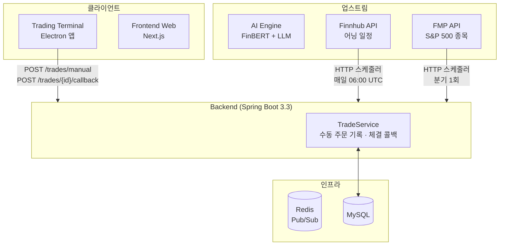

# EarningWhisperer — Backend


어닝콜 트랜스크립트 · 팩트체크 · 종합 판단을 클라이언트에 브로드캐스팅하고, Trading Terminal 에서 사용자가 직접 낸 주문의 결과를 기록하는 중앙 서버입니다.

> **백엔드는 KIS 증권사 API를 직접 호출하지 않습니다.** 매매 실행은 사용자 로컬 PC의 Trading Terminal이 담당합니다.

---

## 시스템 내 역할


```mermaid
flowchart TB
    subgraph Upstream["업스트림"]
        AI[AI Engine\nFinBERT + LLM]
        FIN[Finnhub API\n어닝 일정]
        FMP[FMP API\nS&P 500 종목]
    end

    subgraph Infra["인프라"]
        Redis[(Redis\nPub/Sub)]
        DB[(MySQL)]
    end

    subgraph Backend["Backend (Spring Boot 3.3)"]
        direction TB
        Trade[TradeService\n수동 주문 기록 · 체결 콜백]
    end

    subgraph Clients["클라이언트"]
        TT[Trading Terminal\nElectron 앱]
        FE[Frontend Web\nNext.js]
    end

    Trade <--> DB
    TT -->|"POST /trades/manual\nPOST /trades/{id}/callback"| Backend
    FIN -->|"HTTP 스케줄러\n매일 06:00 UTC"| Backend
    FMP -->|"HTTP 스케줄러\n분기 1회"| Backend
```

---

## 기술 스택

| 분류 | 기술 | 버전 |
|------|------|------|
| Language | Java | 17 |
| Framework | Spring Boot | 3.3.4 |
| ORM | Spring Data JPA + Hibernate | — |
| Database | MySQL | 8.0 |
| Cache / Messaging | Spring Data Redis (Pub/Sub) | — |
| Real-time | Spring WebSocket + STOMP | — |
| Security | Spring Security + JJWT | 0.12.6 |
| External APIs | Finnhub (어닝 일정), FMP (S&P 500 종목) | — |
| Build | Gradle | — |

---

## 빠른 시작

### Prerequisites

- Java 17+
- Docker & Docker Compose (MySQL + Redis 기동용)
- Finnhub API 키 ([무료 발급](https://finnhub.io)) — 어닝 캘린더 기능에 필요

### 1. 인프라 기동

```bash
cd infra
docker-compose up -d
```

MySQL(3306)과 Redis(6379)가 `ew-network`로 연결되어 실행됩니다.

### 2. 환경 변수 설정

`backend/src/main/resources/application-local.yml` 파일을 생성합니다. 이 파일은 `.gitignore`에 등재되어 있어 커밋되지 않습니다.

```yaml
finnhub:
  api-key: your_finnhub_api_key_here

# 기본값을 변경하려면 아래 항목을 추가
# jwt:
#   secret: your_secret_key_minimum_32_chars
```

나머지 설정은 `application.yml`의 기본값을 사용하거나, 환경 변수로 오버라이드할 수 있습니다.

### 3. 실행

```bash
cd backend
./gradlew bootRun
# → http://localhost:8082
```

`bootRun` 태스크는 자동으로 `spring.profiles.active=local`을 활성화합니다.

### 4. 빌드

```bash
./gradlew build      # 전체 빌드 + 테스트
./gradlew clean      # 빌드 산출물 제거
```

---

## 패키지 구조

```
com/earningwhisperer/
│
├── domain/                     # 비즈니스 로직 — Spring 없는 순수 Java
│   ├── earnings/               # 어닝 캘린더 관리
│   ├── portfolio/              # 계좌(BrokerAccount), 보유종목, 잔고 동기화
│   ├── signal/                 # TradeAction (BUY/SELL)
│   ├── stock/                  # S&P 500 종목 마스터 (Stock)
│   ├── trade/                  # 주문 상태 관리 (Trade: PENDING→EXECUTED/FAILED)
│   ├── user/                   # 사용자, JWT 발급, 인증 서비스
│   └── watchlist/              # 관심종목 관리
│
├── infrastructure/             # 외부 시스템 연동
│   ├── demo/                   # DemoReplayService (쇼케이스 데모룸 스크립트 재생)
│   ├── finnhub/                # Finnhub API 클라이언트, 어닝 스케줄러
│   ├── fmp/                    # FMP API 클라이언트, S&P 500 분기 동기화
│   ├── redis/                  # 시장 지수 구독, Pub/Sub 설정
│   ├── security/               # JwtProvider, JwtAuthenticationFilter
│   └── websocket/              # 트랜스크립트 · 팩트체크 · 시세 Publisher, STOMP 인터셉터
│
├── presentation/               # REST Controller 레이어
│   ├── auth/                   # POST /auth/signup, /auth/login
│   ├── earnings/               # GET /earnings-calendar
│   ├── portfolio/              # POST /portfolio/sync, 계좌 · 보유종목 조회
│   ├── trade/                  # GET /trades, POST /trades/manual, POST /trades/{id}/callback
│   ├── user/                   # GET /users/me
│   └── watchlist/              # GET/POST/DELETE /watchlist, GET /watchlist/search
│
└── global/                     # 공통 설정, 예외 처리, BaseEntity
    ├── common/                 # BaseEntity (createdAt, updatedAt 자동 관리)
    ├── config/                 # Security, WebSocket, JPA, Async 설정
    ├── error/                  # 예외 정의
    └── exception/              # GlobalExceptionHandler
```

**레이어 접근 원칙:** `domain` → 다른 레이어에 의존하지 않습니다. `infrastructure`, `presentation` → `domain`만 의존합니다.

---

## 핵심 개념

### 주문 처리

EarningWhisperer 는 어닝콜 분석 프로그램이고, 주문은 사용자가 Trading Terminal 에서 직접 냅니다. 백엔드는 주문을 지시하지 않고 결과만 기록합니다. 매매 신호로 주문을 내던 경로(룰 엔진, 매매 모드, `/user/queue/signals`)는 #127 에서 제거했습니다.

1. 터미널이 KIS 로 주문을 내고 `POST /api/v1/trades/manual` 로 결과를 기록합니다 (`EXECUTED` / `PENDING` / `FAILED`).
2. 접수만 된 `PENDING` 주문은 체결되면 `POST /api/v1/trades/{tradeId}/callback` 으로 종결합니다.
3. 24시간(`app.trade.manual-pending-ttl-seconds`) 안에 종결되지 않은 `PENDING` 은 스케줄러가 `EXPIRED` 로 바꿉니다.

---

## REST API

| Method | Path | 인증 | 설명 |
|--------|------|------|------|
| POST | `/api/v1/auth/signup` | — | 회원가입 |
| POST | `/api/v1/auth/login` | — | 로그인 (JWT 발급) |
| GET | `/api/v1/users/me` | ✓ | 내 프로필 조회 |
| POST | `/api/v1/portfolio/sync` | ✓ | Trading Terminal 잔고 동기화 |
| GET | `/api/v1/watchlist` | ✓ | 관심종목 목록 조회 |
| POST | `/api/v1/watchlist` | ✓ | 관심종목 추가 |
| DELETE | `/api/v1/watchlist/{ticker}` | ✓ | 관심종목 삭제 |
| GET | `/api/v1/watchlist/search?q=` | ✓ | 종목 검색 (최대 20건) |
| GET | `/api/v1/earnings-calendar?days=` | ✓ | 관심종목 어닝 일정 조회 |
| POST | `/api/v1/earnings-calendar/sync` | — | 어닝 일정 수동 갱신 (개발용) |
| GET | `/api/v1/trades?page=&size=` | ✓ | 거래내역 페이징 조회 |
| POST | `/api/v1/trades/manual` | ✓ | 수동 주문 결과 기록 |
| POST | `/api/v1/trades/{tradeId}/callback` | ✓ | 체결 결과 콜백 수신 |

상세 계약은 [`docs/api-spec.md`](../docs/api-spec.md)를 참조하세요.

---

## WebSocket 채널

백엔드는 두 개의 WebSocket 엔드포인트를 제공합니다.

| 엔드포인트 | 클라이언트 | 프로토콜 |
|-----------|-----------|---------|
| `/ws` | Frontend (브라우저) | SockJS (WebSocket 폴백 포함) |
| `/ws-native` | Trading Terminal | Native WebSocket |

| STOMP 채널 | 유형 | 메시지 | 대상 |
|-----------|------|--------|------|
| `/topic/live/demo` | Public Broadcast | 데모 재생 신호 + 주가 | Frontend 데모룸 |
| `/topic/transcript/{ticker}` | Public Broadcast | 어닝콜 트랜스크립트 세그먼트 | Trading Terminal · Frontend |

---

## 환경 변수

| 변수명 | 기본값 | 필수 | 설명 |
|--------|--------|------|------|
| `DB_USERNAME` | `root` | — | MySQL 접속 사용자명 |
| `DB_PASSWORD` | `password` | — | MySQL 접속 비밀번호 |
| `REDIS_HOST` | `localhost` | — | Redis 호스트 |
| `REDIS_PORT` | `6379` | — | Redis 포트 |
| `JWT_SECRET` | 개발용 기본값 | **운영 필수** | JWT 서명 키 (최소 32자 이상) |
| `FINNHUB_API_KEY` | (빈 값) | 권장 | Finnhub API 키. 미설정 시 어닝 스케줄러 비활성화 |
| `FMP_API_KEY` | (빈 값) | 선택 | FMP API 키. 미설정 시 S&P 500 자동 동기화 비활성화 |

---

## 테스트

```bash
./gradlew test
```

외부 의존성을 격리합니다 — MySQL은 H2로, Redis/KIS API는 `@MockBean`으로 대체합니다. 테스트 실행과 작성 관례는 [`docs/developer/testing.md`](../docs/developer/testing.md)에 있습니다.

---

## 관련 문서

| 문서 | 설명 |
|------|------|
| [`docs/api-spec.md`](../docs/api-spec.md) | 서비스 간 API & 데이터 컨트랙트 전체 명세 |
| [`docs/db-schema.md`](../docs/db-schema.md) | DB 스키마 상세 (테이블, 인덱스, 비즈니스 규칙) |
| [`docs/developer/architecture.md`](../docs/developer/architecture.md) | 시스템 구성과 주요 흐름 |
| [`docs/developer/testing.md`](../docs/developer/testing.md) | 테스트 실행과 작성 관례 |
