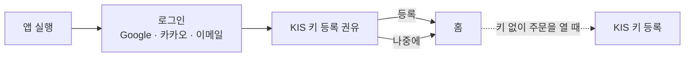
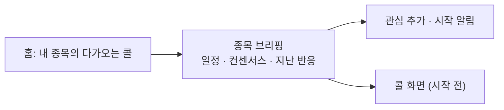
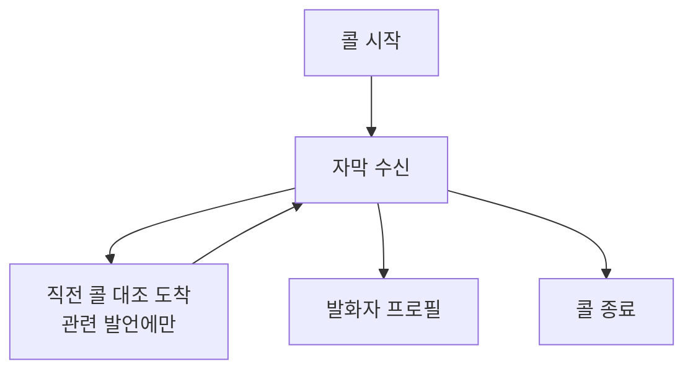
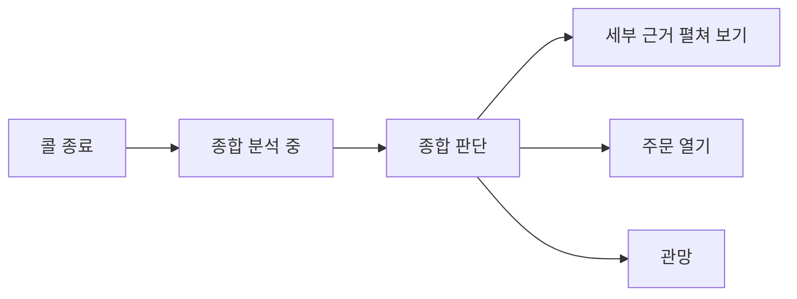
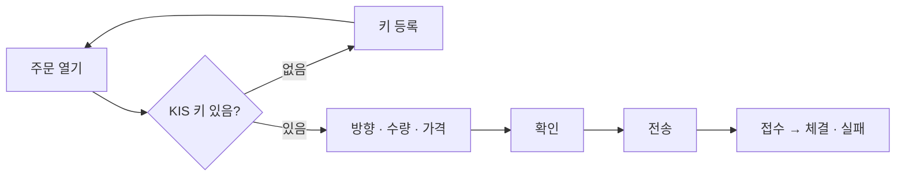
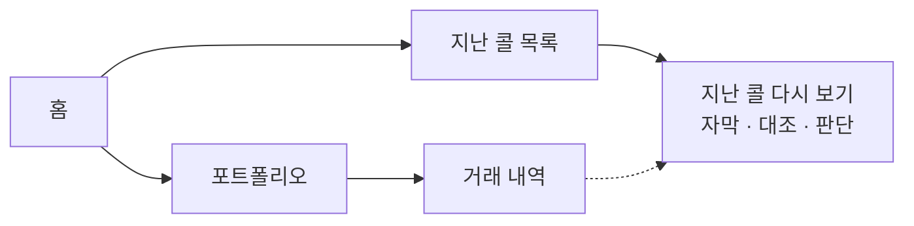
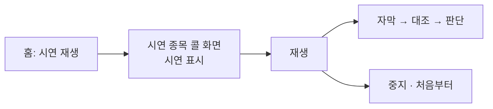

# Trading Terminal UX

EarningWhisperer Trading Terminal 의 UX 설계 기준을 정리한 문서입니다. 설계 원칙, 정보 구조, 핵심 흐름,
인터랙션 규칙을 다루며 화면을 설계하거나 고치는 기여자를 위한 문서입니다. 색 · 타이포 · 컴포넌트 외형은
[디자인 시스템](design-system.md)에서, 화면별 영역 구성과 상태는 화면 명세에서 다룹니다.

## 설계 원칙

| 원칙 | 내용 | 이유 |
|---|---|---|
| 어닝콜이 중심입니다 | 콜 준비 · 시청 · 판단이 주인공이고 주문 · 자산은 보조입니다 | 앱이 다른 증권 앱과 구별되는 지점이 어닝콜 분석입니다 |
| 화면은 콜의 시간을 따릅니다 | 같은 콜 화면이 시작 전 → 진행 중 → 종료 후로 주인공을 바꿉니다 | 시점마다 사용자가 하는 일이 다릅니다 (준비 → 이해 → 결정) |
| 기본 상태는 조용합니다 | 대부분의 발언에는 아무것도 붙지 않고, 위험한 변화만 눈에 띕니다 | 콜을 듣는 동안 화면을 오래 읽을 수 없습니다 |
| 읽는 동안 화면을 움직이지 않습니다 | 사용자가 위로 올려 읽는 중에는 새 내용이 와도 스크롤하지 않고 알림만 둡니다 | 실시간 화면에서 읽던 위치를 잃는 것이 가장 큰 불편입니다 |
| 실제 돈이 걸린 행동에는 마찰을 둡니다 | 주문은 확인 단계를 거치고, 실전 모드는 늘 크게 표시합니다 | 되돌릴 수 없는 행동입니다 |
| 시연은 구분합니다 | 시연 재생은 진입점이 하나이고 화면에 늘 표시됩니다 | 실제 콜과 시연이 같은 경로로 들어와 구분되지 않으면 오해가 생깁니다 |
| 아직 없는 기능은 자리만 둡니다 | 구현 예정 기능은 동작하지 않는 자리로 남기되, 동작하는 것처럼 보이지 않게 합니다 | 나중에 배치를 다시 흔들지 않기 위해서입니다 |

## 사용자와 해결하려는 일

대상 사용자, 해결하려는 일(J1~J6), 기능 범위는 [제품 정의](../product.md)가 원본입니다. 이 문서의 흐름은
그 문서의 J1~J6 을 따릅니다. 화면 위계는 J2(콜 시청)와 J3(종료 후 판단)를 중심에 두고 J1 을 입구,
J4 · J5 를 보조로 둡니다.

## 정보 구조

### 메뉴

| 메뉴 | 역할 |
|---|---|
| 열린 콜 (조건부) | 콜 화면을 열면 메뉴 맨 위에 생깁니다. 종목과 콜 상태(시작 전 · LIVE · 시연 · 종료)를 보여 주고 누르면 콜 화면으로 돌아갑니다 |
| 홈 | 진행 중인 콜, 내 종목의 다가오는 콜, 전체 일정, 지난 콜, 시장 · 계좌 요약 |
| 종목 | S&P 500 목록과 검색, 관심 · 보유 · 이번 주 콜 필터 |
| 포트폴리오 | 자산과 거래 내역 |
| 설정 | KIS 연동, 앱 설정 |

어닝콜을 고정 메뉴로 두지 않는 이유는, 콜이 분기마다 열리는 드문 이벤트라 고정 메뉴로 두면 대부분의 시간에
빈 화면이 되기 때문입니다. 지난 콜은 홈에서 들어갑니다.

연결 상태와 KIS 토큰 상태는 메뉴 아래쪽 한 곳에만 표시합니다.

### 화면

| 화면 | 역할 | 들어오는 길 |
|---|---|---|
| 로그인 | 계정 진입 | 앱 실행 |
| KIS 키 등록 권유 | 주문용 키 등록. 건너뛸 수 있습니다 | 첫 로그인 직후, 키 없이 주문을 열 때 |
| 홈 | 어닝콜 중심 첫 화면 | 메뉴 |
| 종목 | 종목 찾기 | 메뉴, 검색 |
| 종목 브리핑 | 다음 콜 기준 정보, 관심 추가, 콜 화면 열기. 어느 화면에서나 오른쪽 패널로 열립니다 | 홈 · 종목 · 포트폴리오의 종목 행, 파급 영향 종목 |
| 콜 화면 | 시작 전 브리핑 → 자막과 직전 콜 대조 → 종합 판단 | 종목 브리핑, 홈의 콜 행, 열린 콜 슬롯, 콜 시작 알림 |
| 주문 패널 | 콜 화면 · 종목 브리핑에서 여는 보조 패널 | 주문 버튼 |
| 발화자 프로필 | 콜 참가자와 이번 콜 발언 집계 | 콜 화면의 발화자 버튼, 자막의 발화자 이름 |
| 포트폴리오 | 자산 · 보유 / 거래 내역 탭 | 메뉴, 홈의 계좌 요약 |
| 설정 | KIS 연동, 앱 설정 | 메뉴 |

## 핵심 흐름

### 처음 시작

- 분석 기능은 KIS 키 없이 모두 씁니다. 키 등록은 권하되 건너뛸 수 있고, 주문하려는 순간에 다시 안내합니다.
- 지금은 앱을 다시 켜면 로그인을 다시 합니다. 로그인 유지는 아래 "아직 정하지 않은 것" 에 둡니다.

### 콜 준비 (J1)

- 홈의 첫 정보는 시장 전체가 아니라 관심 · 보유 종목의 다가오는 콜입니다.
- 종목 브리핑은 "이 콜을 듣기 전에 알아야 할 것" 을 위로 올립니다. 다음 콜 일정, 컨센서스, 지난 분기 어닝 반응입니다.
- 시작 전에 콜 화면에 들어가면 빈 자막 대신 브리핑과 카운트다운이 보이고, 콜이 시작되면 자막으로 바뀝니다.
- 콜 시작은 OS 알림으로 알려 줍니다. 앱은 창을 닫아도 트레이에 남아 있어 알림을 받을 수 있습니다.

### 콜 시청 (J2)

- 자막을 읽는 것이 주된 행동입니다. 자막이 화면에서 가장 넓은 자리를 씁니다.
- 직전 콜 대조 결과는 해당 발언 바로 아래에 붙습니다. 대조 항목이 발언 번호를 갖고 오기 때문에 가능합니다.
  따로 떨어진 목록에 쌓이면 어느 발언에 대한 것인지 눈으로 다시 찾아야 합니다.
- 대조는 주제(가이던스 · 마진 · 수요 등)와 관련된 발언에만 와서 대부분의 발언에는 아무것도 붙지 않습니다.
  `후퇴` 이거나 위험 점수가 높은 항목만 펼쳐 보이고, 나머지 변화 유형은 작은 표시로 둡니다.
- 무엇과 비교했는지(직전 콜의 분기)를 콜 화면 위쪽에 보여 줍니다. 지금 데이터로는 첫 대조 항목이 도착해야 비교 대상을
  알 수 있어, 그 전에는 비워 둡니다. 콜 시작부터 보이려면 서버가 비교 대상을 먼저 알려 줘야 합니다.
- 가격 · 보유 정보는 콜 중에는 보조 자리로 내립니다.
- 번역, 용어 정의, 발언 지정 질의응답은 동작 방식이 정해지지 않은 기능입니다. 각각 자막 안(번역 · 용어)과 보조 자리
  (질의응답)에 들어갈 자리만 둡니다.

### 콜 종료 후 판단 (J3)

- 콜이 끝나면 화면의 주인공이 자막에서 종합 판단으로 바뀝니다. 자막은 좁은 자리로 물러나 다시 볼 수 있게 남습니다.
- 종합 판단의 첫 줄은 방향(강세 · 약세)이 아니라 실행 판단(권고 행동과 실행 조건)입니다. `강세` 와 `실행 보류` 가
  함께 나오는 일이 정상인데, 방향만 크게 보이면 바로 사도 된다는 신호로 오해합니다.
- 판단 근거, 반대 논거, 질문 회피, 파급 영향은 요약을 먼저 보이고 펼쳐서 봅니다.
- 파급 영향의 관련 종목은 눌러서 그 종목 브리핑으로 갑니다.
- 손절 · 익절 계획은 참고 정보입니다. 주문 입력과 연결하지 않습니다. 계획대로 주문이 자동으로 채워지면
  사용자가 확인 없이 따라가기 쉽기 때문입니다.
- 판단이 오지 않으면 대기 문구를 무한히 두지 않고, 일정 시간 뒤 받지 못했다는 안내로 바꿉니다.

### 주문 (J4)

- 주문은 콜 화면을 떠나지 않고 여는 보조 패널입니다.
- 모의 · 실전 모드를 패널 맨 위에 크게 표시합니다.
- 전송 전에 확인 단계를 거칩니다. 실전 모드에서는 끌 수 없습니다.
- `즉시 체결` 은 시장가가 아니라 현재가 ±1% 지정가라는 점을 화면에 보여 줍니다.
- KIS 계좌가 아닌 자체 페이퍼 계정은 키 없이 가상으로 체결하므로 키 등록 안내를 거치지 않습니다.
- 매도의 최대 수량은 보유 수량 기준입니다.
- 접수에서 체결로 바뀌는 것을 주문한 자리에서 봅니다.

### 되돌아보기 (J5)

- 지난 콜의 자막 · 대조 · 판단을 다시 볼 수 있어야 합니다. 서버가 콜 결과를 저장하고 돌려줘야 해서 서버 작업이
  선행되어야 합니다.
- 콜 화면에서 낸 주문은 그 콜로 돌아가는 연결을 가집니다.

### 시연 (J6)

- 시연 진입점은 홈에 하나만 둡니다. 시연 종목(WMT)이 자동으로 정해져 다른 종목에서 재생하는 실수가 없습니다.
- 시연 중에는 콜 화면과 열린 콜 슬롯에 시연 표시가 늘 보입니다.
- 재생은 중지하고 처음부터 다시 할 수 있습니다.

## 인터랙션 규칙

| 상황 | 규칙 |
|---|---|
| 실시간으로 쌓이는 목록 | 맨 아래를 보고 있을 때만 따라 내려갑니다. 위로 올려 읽는 중에는 멈추고 "새 항목 N개" 로 알립니다 |
| 데이터를 불러오지 못했을 때 | 마지막으로 받은 값을 남기고 실패 사유와 시각, 다시 시도를 덮어 보여 줍니다. 빈 화면으로 바꾸지 않습니다 |
| 데이터가 아직 없을 때 | "불러오는 중" 과 "데이터 없음" 과 "실패" 를 구분합니다 |
| 종목 이름이 보이는 곳 | 누르면 종목 브리핑이 열립니다 |
| 오른쪽 패널 · 모달 | Esc, 닫기 버튼, 바깥 클릭으로 닫힙니다 |
| 오류 알림 | 오류 종류별로 유지 시간과 행동 버튼(다시 로그인 · 다시 시도)을 정해 둡니다 |
| 자리만 있는 기능 | 눌러도 아무 일이 없는 대신 "준비 중" 임을 보여 줍니다 |
| 방향 표시 | 상승 · 하락 색은 한국 관례를 따릅니다. 대조 유형 · 판단 색과 겹치지 않게 디자인 시스템에서 정합니다 |

## 아직 정하지 않은 것

| 항목 | 상태 |
|---|---|
| 한국어 번역 · 용어 정의 · 발언 지정 질의응답 | 계획(#110 · #111 · #112)이지만 동작 방식이 정해지지 않아 자리만 둡니다 |
| 로그인 유지 | 지금은 보안상 로그인 정보를 디스크에 남기지 않습니다. 유지하려면 보관 방식부터 정해야 합니다 |
| 자체 페이퍼 계정 | KIS 없이 가상 체결하는 계정을 계속 둘지 정해지지 않았습니다 |
| 콜 중 키보드 단축키 | 후보만 있습니다 |
| 모의 모드에서 주문 확인을 끌 수 있게 할지 | 미정입니다 |
