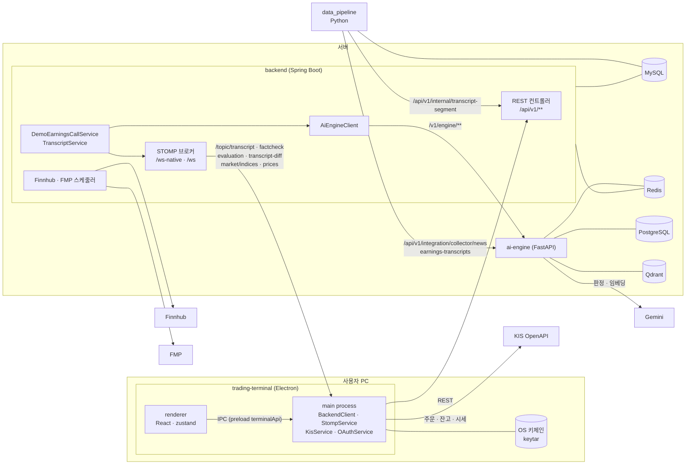
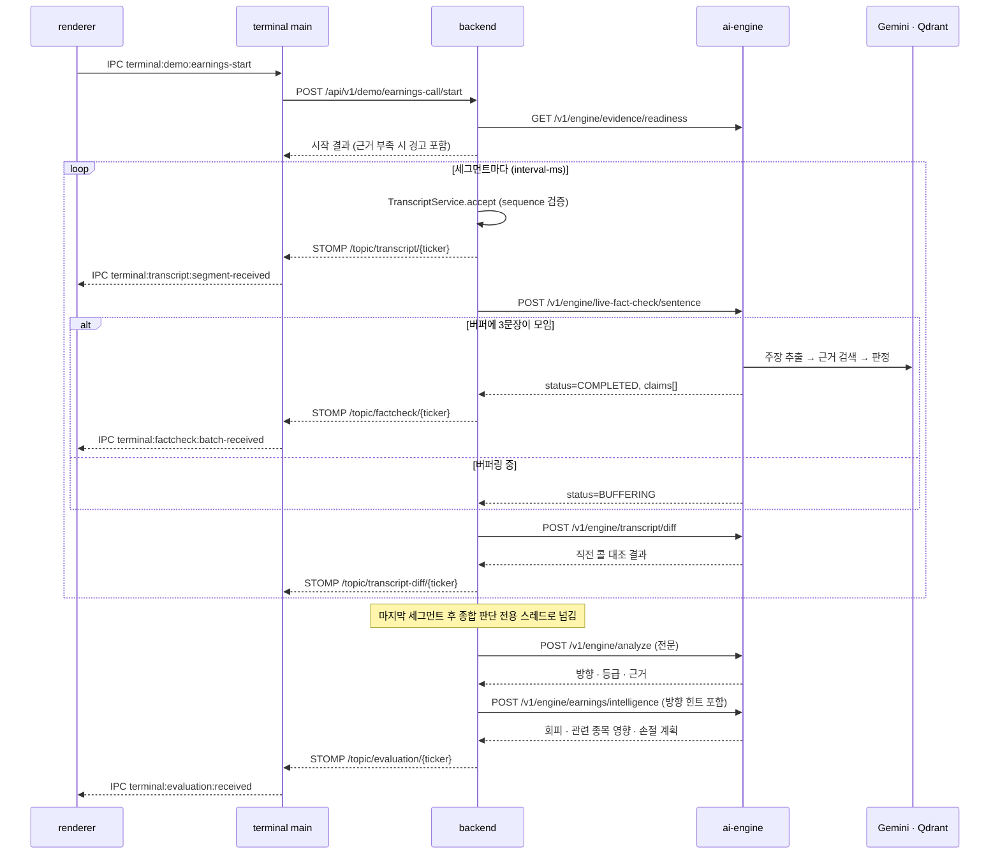
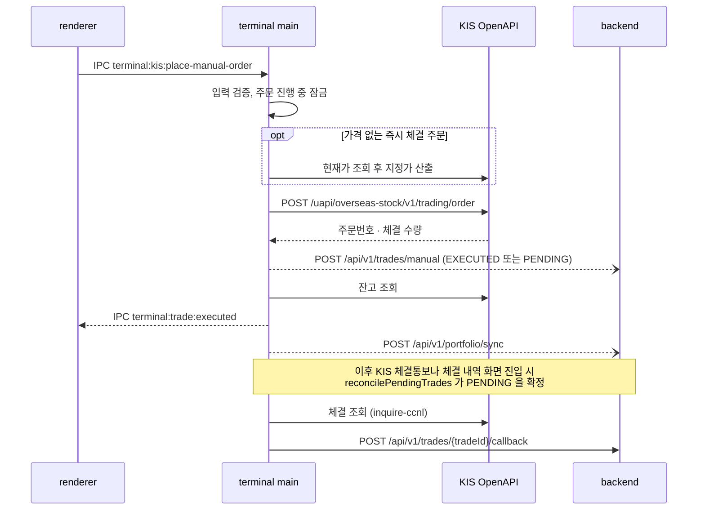
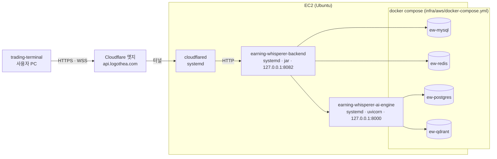

# 아키텍처

EarningWhisperer 의 모듈 구성과 모듈 사이의 흐름을 설명합니다. 코드를 처음 읽는 팀원과 설계를 살펴보는
평가자를 위한 문서입니다. 자주 바뀌지 않는 구조만 다룹니다. 요청·응답 필드 같은 계약 상세는
[`docs/api-spec.md`](../api-spec.md), 설계 결정의 배경은 [`docs/adr/`](../adr/) 에 둡니다.

코드 위치는 링크 대신 클래스·파일 이름으로 적습니다. 저장소에서 이름으로 검색하면 찾을 수 있습니다.

## 조감도

EarningWhisperer 는 미국 기업의 어닝콜 발언을 문장 단위로 받아 데스크톱 터미널에 자막으로 띄우고 세
문장마다 사실 주장을 뽑아 수집해 둔 뉴스 근거로 판정한 결과를 함께 보여 줍니다. 콜이 끝나면 발언 전체를
놓고 종합 판단(방향, 등급, 답변 회피, 관련 종목 영향, 손절·익절 계획)을 만듭니다. 사용자는 같은 화면에서
KIS 계좌로 주문합니다. 주문은 서버를 거치지 않고 사용자 PC 에서 KIS 로 나갑니다. 현재 시연에서는 STT 대신
backend 가 녹취록 발췌를 재생하고, 재생한 발언의 팩트체크·종합 판단은 ai-engine 이 그때그때 만듭니다. STT 가
쓰는 인입 경로(`TranscriptService`)는 자막만 발행하며 아직 ai-engine 을 호출하지 않습니다.

## 모듈

### trading-terminal

Electron 31, React 18, Vite(electron-vite), TypeScript 로 만든 데스크톱 앱입니다. 화면과 KIS 주문을 맡고
backend 와 통신합니다.

진입점은 세 개입니다.

| 프로세스 | 진입점 | 하는 일 |
|---|---|---|
| main | `src/main/index.ts` | 창 생성, IPC 핸들러 등록, 네트워크·키체인 접근 |
| preload | `src/preload/index.ts` | `contextBridge` 로 `window.terminalApi`(`invoke`, `on`, `platform`)만 노출 |
| renderer | `src/renderer/main.tsx`, `App.tsx` | 페이지(Auth, Dashboard, Market, TradingRoom, History, Settings) |

| 찾는 것 | 위치 |
|---|---|
| backend REST 호출, access token 갱신 | `src/main/services/BackendClient.ts` |
| STOMP 연결·구독·재연결 | `src/main/services/StompService.ts` |
| KIS REST(토큰, 잔고, 현재가, 주문, 체결 조회)와 키체인 저장 | `KisService.ts`, 속도 제한은 `KisRateLimiter.ts` |
| KIS 실시간 체결통보 | `src/main/services/KisWebSocketService.ts` |
| 관심·보유 종목 시세 폴링 | `src/main/services/PricePoller.ts` |
| Google·Kakao 로그인(PKCE, 루프백 리다이렉트) | `src/main/services/OAuthService.ts` |
| IPC 채널 이름과 핸들러 | `src/lib/ipcChannels.ts` (`IPC_CHANNELS`), `src/main/ipc/*Handlers.ts` |
| main 프로세스 상태(토큰, 계좌 유형, 주문 진행 여부) | `src/main/store/mainState.ts` |
| 화면 상태 | `src/renderer/store/use*Store.ts` (zustand) |
| 어닝콜 자막·팩트체크·종합 판단 화면 | `src/renderer/pages/TradingRoomPage.tsx`, `components/trading/` |

STOMP 메시지는 main 프로세스가 받아 IPC 이벤트(`terminal:transcript:segment-received`,
`terminal:factcheck:batch-received`, `terminal:evaluation:received` 등)로 renderer 에 넘깁니다. renderer 의
`useLiveTranscript`, `useFactCheck`, `useEarningsSummary`, `useTranscriptDiff` 훅이 이 이벤트를 store 에
반영합니다.

계좌 유형은 `KIS_REAL`, `KIS_PAPER`, `SELF_PAPER` 세 가지입니다. `SELF_PAPER` 는 KIS 를 거치지 않고 시세
캐시 기준으로 가상 체결합니다.

### backend

Spring Boot 3.3, Java 17 서버로 인증, 어닝콜 세그먼트 인입과 STOMP 전달, ai-engine 호출, 주문 기록,
시장 데이터 수집을 맡습니다. 진입점은 `EarningWhispererApplication`, 설정은 `application.yml`, 포트는 8082
입니다. 패키지는 `com.earningwhisperer` 아래 `presentation`(컨트롤러·DTO), `domain`(엔티티·리포지토리·도메인
서비스), `infrastructure`(외부 연동, STOMP 발행, 보안, 시연 재생), `global`(설정, 예외 처리) 네 층입니다.

| 찾는 것 | 위치 |
|---|---|
| 시연 어닝콜 재생(시작·중지·상태) | `DemoEarningsCallController`, `DemoEarningsCallService`, `resources/data/demo-earnings-call.json` |
| 세그먼트 검증(sequence 단조성, 세션 종료)과 STOMP 발행 | `TranscriptService`, `TranscriptSessionRegistry`, `TranscriptPublisher` |
| data_pipeline 세그먼트 인입 | `TranscriptInternalController`, `InternalSecretFilter` |
| ai-engine 호출 | `AiEngineClient` (`LiveFactCheckModels`, `EarningsSummaryModels`, `TranscriptDiffModels`) |
| 콜 종료 후 종합 판단 | `EarningsSummaryService`, `EarningsSummaryPublisher` |
| STOMP 설정과 인증 | `WebSocketConfig`, `StompJwtChannelInterceptor` |
| 로그인, JWT, refresh token | `AuthController`, `OAuthController`, `AuthService`, `JwtProvider`, `RefreshTokenService`, `RedisRefreshTokenRepository` |
| 주문 기록·조회 | `TradeController`, `TradeService`, `TradePendingExpiryScheduler` |
| 계좌·포트폴리오 동기화 | `PortfolioController`, `BrokerAccountService`, `PositionService` |
| 시장 지수 | `MarketIndicesScheduler` → Redis `market-indices` → `MarketIndicesSubscriber` → `MarketIndicesCache`, `MarketIndicesPublisher` |
| 종목 시세 | `FinnhubWebSocketManager` → `StockPriceCache` → `StockPricePublisher`(1초 주기) |
| 실적 일정·일봉·종목 메타 | `infrastructure/finnhub`, `infrastructure/fmp` 의 `*Scheduler` |

### ai-engine

FastAPI 서버이고 포트는 8000 입니다. 진입점은 `main.py` 의 `app` 이며 `api/routers/` 의 라우터를 모두
등록합니다. 팀원 소유 모듈이므로 아래는 backend·data_pipeline 과 맞닿는 부분만 정리합니다.

| 찾는 것 | 위치 |
|---|---|
| 실시간 팩트체크(문장 버퍼, 3문장마다 주장 추출 → 근거 대조) | `api/routers/live_fact_check.py`, `services/live_news_fact_check_service.py` (`LiveNewsFactCheckService`) |
| 종합 판단 / 회피·관련 종목 영향·손절 계획 | `core/analysis_service.py` / `services/earnings_intelligence_service.py` |
| 직전 콜 대조(저장된 핵심 문장 중 관련 문장을 LLM 이 번호로 고름. 문장이 없으면 청크 검색) | `api/routers/transcript_diff.py`, `services/transcript_diff_service.py`, `services/transcript_statement_diff.py` |
| 직전 콜 핵심 문장 추출(적재 시 경영진 문장을 원문 그대로 골라 저장) | `services/transcript_statement_extraction_service.py`, `services/transcript_statement_service.py`, `repositories/transcript_statement_repository.py` |
| 근거 준비 확인, 수집기 인입 | `api/routers/integration.py`, `services/news_ingestion_service.py` |
| 근거 저장소(Qdrant) / 분석 이벤트 저장(PostgreSQL) | `QdrantEvidenceRepository` / `EventStoreRepository` (`repositories/`) |
| Gemini 호출 | `core/gemini_client.py` (`GeminiClient`) |
| 설정 | `config.py` (`GEMINI_API_KEY`, `DATABASE_URL`, `QDRANT_URL`, `EMBEDDING_PROVIDER` 등) |

backend 가 호출하는 엔드포인트는 `/v1/engine/live-fact-check/sentence`, `/v1/engine/analyze`,
`/v1/engine/earnings/intelligence`, `/v1/engine/transcript/diff`, `/v1/engine/evidence/readiness` 다섯 개입니다
(`AiEngineClient` 상수).

### data_pipeline

팀원 소유 모듈인 Python 수집기 모음입니다. 진입점은 `main.py` 이며 `scheduler.start_scheduling()` 이
APScheduler 로 `EarningsOrchestrator`(`orchestrator.py`)의 작업을 매일 정해진 시각에 돌립니다.

| 찾는 것 | 위치 |
|---|---|
| 종목·일정·가격·지표·재무제표 수집 | `collectors/` 의 각 Strategy, `CollectorChain` |
| 웹캐스트 음성 인식(faster-whisper)과 세그먼트 전송 | `stt_worker/take.py`, `stt_worker/manager.py` (`STTWorkerManager`) |
| 뉴스·녹취록 → ai-engine 적재 | `collectors/news/`, `collectors/transcripts/` (`/api/v1/integration/collector/*`) |
| 시연 근거 수집 도구 | `tools/demo/collect_demo_evidence.py`, `tools/demo/ingest_demo_transcript.py` |

STT 워커는 세그먼트를 backend `/api/v1/internal/transcript-segment` 로 `X-Internal-Secret` 헤더와 함께
보냅니다. STT 모니터링은 `ENABLE_STT_MONITOR=true` 일 때만 켜집니다. 시연 서버에는 data_pipeline 을 올리지
않습니다.

## 주요 흐름

### 어닝콜 재생과 팩트체크

시연에서는 `DemoEarningsCallService` 가 스크립트를 `demo.earnings-call.interval-ms`(기본 6000ms) 간격으로
`TranscriptService` 에 넣습니다. data_pipeline 의 STT 가 `/api/v1/internal/transcript-segment` 로 넣는 것과
같은 인입 경로입니다. 재생·팩트체크·직전 콜 대조를 세션마다 별도 스레드로 돌리므로 자막은 ai-engine 응답을
기다리지 않습니다.

ai-engine 의 `/v1/engine/live-fact-check/sentence` 는 항상 HTTP 200 을 돌려주고 결과를 본문 `status`
(`BUFFERING`, `COMPLETED`, `REJECTED`, `DISCARDED`)로 구분합니다. 세션이 끝날 때 3문장에 못 미치는
나머지 문장은 `DISCARDED` 로 버려지므로 시연 스크립트의 세그먼트 수를 3의 배수로 맞춥니다. 종합 판단은
별도 `demo-call-summary` 스레드에서 돌아갑니다. 그 사이 같은 종목이 다시 재생되면 이전 회차 판단은 발행하지 않습니다.

### 수동 주문

주문은 terminal main 프로세스가 KIS 로 직접 보내고 결과를 backend 에 기록합니다. backend 는 KIS 를
호출하지 않습니다.

backend 기록과 포트폴리오 동기화는 비동기로 보냅니다. 기록이 실패해도 이미 나간 주문은 되돌리지 않습니다.
활성 증권 계좌가 없으면 `/api/v1/trades/manual` 은 422 입니다. 확정되지 않은 PENDING 은
`TradePendingExpiryScheduler` 가 `app.trade.manual-pending-ttl-seconds`(기본 86400초) 뒤 만료 처리합니다.

## 배포 구성

시연 서버는 EC2 인스턴스 한 대입니다. backend 와 ai-engine 은 systemd 서비스로, 저장소는 docker compose
컨테이너로 돌아갑니다. 외부 요청은 Cloudflare Tunnel 로만 들어옵니다. 절차와 운영은
[`infra/DEPLOY.md`](../../infra/DEPLOY.md) 를 참고합니다.

보안 그룹은 SSH 만 엽니다. backend 와 ai-engine 은 루프백 주소만 듣고 컨테이너 포트도 `127.0.0.1` 에만
바인딩합니다. 터널 라우팅은 `infra/aws/cloudflared-config.yml`, backend·ai-engine systemd 유닛은
`infra/aws/*.service` 에 있습니다. cloudflared 유닛은 `cloudflared service install` 이 만든 것이라 저장소에 없습니다.

## 불변식

코드로 확인한 구조 규칙입니다. 이 규칙을 바꾸는 변경은 ADR 로 남깁니다.

- **backend 는 KIS 를 호출하지 않습니다.** KIS 주소(`openapi.koreainvestment.com`,
  `openapivts.koreainvestment.com`)는 터미널 main 프로세스의 `KisService`·`KisWebSocketService` 에만 있고 backend
  코드에는 없습니다. backend 는 터미널이 보고한 주문 결과와 잔고만 저장합니다.
- **KIS 자격증명은 사용자 PC 밖으로 나가지 않습니다.** 앱 키, 시크릿, 계좌번호, KIS 토큰은 `keytar` 로 OS
  키체인(서비스 이름 `EarningWhisperer`)에 저장하고 backend 로 보내는 요청에는 포함하지 않습니다.
- **renderer 는 Node API 와 네트워크에 직접 접근하지 않습니다.** `BrowserWindow` 는 `nodeIntegration: false`,
  `contextIsolation: true`, `sandbox: true` 로 만듭니다. preload 는 `invoke`·`on`·`platform` 만 노출합니다.
  backend·KIS 호출과 STOMP 연결은 모두 main 프로세스에 있습니다.
- **STOMP 는 서버에서 클라이언트로만 흐릅니다.** `StompJwtChannelInterceptor` 는 인증되지 않은 세션의 프레임과
  인증된 세션의 클라이언트 SEND 를 모두 거부합니다. `@MessageMapping` 은 쓰지 않습니다.
- **ai-engine 장애가 어닝콜 재생을 멈추지 않습니다.** `AiEngineClient` 는 타임아웃·4xx·5xx·역직렬화 오류를
  모두 흡수해 빈 결과를 돌려주고 호출자는 해당 발행만 건너뜁니다. 자막은 계속 나갑니다.
- **같은 종목의 팩트체크 문장은 순서대로 제출합니다.** 순서가 뒤집히면 ai-engine 이 `REJECTED` 로 버립니다.
  `DemoEarningsCallService` 의 단일 스레드 executor 가 순서를 보장합니다.
- **세그먼트는 같은 `call_id` 안에서 sequence 가 증가해야 합니다.** 역행은 400, 세션 종료 뒤 인입은 409
  입니다(`TranscriptSessionRegistry`). 재생마다 새 `call_id` 를 만듭니다.

## 공통 관심사

### 인증

| 항목 | 내용 |
|---|---|
| access token | JWT, 수명 15분(`jwt.expiration-ms`). 터미널은 main 프로세스 메모리(`mainState.backendToken`)에만 둡니다 |
| refresh token | 수명 7일. backend 는 `refresh_token` HttpOnly 쿠키(경로 `/api/v1/auth`)로 내려주고 Redis 에 `rt:token:{uuid}` 로 저장합니다. 갱신할 때마다 회전하며, 재사용이 감지되면 같은 family 전체를 무효화합니다. 터미널은 `Set-Cookie` 에서 값을 꺼내 메모리(`mainState.backendRefreshToken`)에 둡니다 |
| 로그인 | 이메일·비밀번호는 `/api/v1/auth/login`, Google·Kakao 는 터미널 `OAuthService` 가 PKCE 와 state 를 만들어 기본 브라우저로 인가를 받고, 루프백 서버(`127.0.0.1:9000`)로 받은 code 를 `/api/v1/auth/oauth/callback` 에 넘깁니다 |
| REST 인가 | `JwtAuthenticationFilter` 가 `Authorization: Bearer` 를 검증합니다. `/api/v1/auth/**`, 시장 지수, `/api/v1/stocks/sp500`, `/api/v1/stocks/prices`, `/actuator/health` 등은 인증 없이 열려 있습니다(`SecurityConfig`) |
| STOMP 인가 | HTTP 단에서는 `/ws/**`, `/ws-native/**` 를 열어 두고, CONNECT 프레임의 `Authorization: Bearer` 를 `StompJwtChannelInterceptor` 가 검증합니다. 실패하면 ERROR 프레임(`STOMP 인증 실패`)으로 끊고, 터미널 `StompService` 는 이 문구를 보면 access token 을 한 번 갱신해 다시 연결합니다. 갱신한 토큰으로도 거부되면 백오프(2~30초)로 재연결합니다 |
| 내부 엔드포인트 | `/api/v1/internal/**` 는 `X-Internal-Secret` 헤더를 `InternalSecretFilter` 가 검증합니다. `INTERNAL_SECRET` 이 비어 있으면 모두 401 입니다 |

### 실시간 전달

backend 는 Spring simple broker 를 씁니다(`/topic`, `/queue`, 사용자 목적지 접두사 `/user`). `/queue`·`/user` 로
보내는 곳은 지금 없습니다([ADR 0001](../adr/0001-use-stomp-for-realtime-delivery.md) 후속 조치). 터미널은
`/ws-native`(native WebSocket)로, 웹 클라이언트는 `/ws`(SockJS)로 붙습니다. 터미널은 재연결한 뒤 종목별 구독을
복구합니다. 메시지 형식은 [`docs/api-spec.md`](../api-spec.md) 4.4~4.7절, backend 와
ai-engine 사이 계약은 9절에 있습니다. 직전 콜 대조(`transcript-diff`)와 `/topic/prices` 는 아직 api-spec 에
없습니다.

| 목적지 | 발행 클래스 | 내용 | 구독 |
|---|---|---|---|
| `/topic/transcript/{ticker}` | `TranscriptPublisher` | 어닝콜 세그먼트 | 터미널 |
| `/topic/factcheck/{ticker}` | `FactCheckPublisher` | 3문장 배치 팩트체크 결과 | 터미널 |
| `/topic/transcript-diff/{ticker}` | `TranscriptDiffPublisher` | 직전 콜 대조 결과 | 터미널 |
| `/topic/evaluation/{ticker}` | `EarningsSummaryPublisher` | 콜 종료 후 종합 판단 | 터미널 |
| `/topic/market/indices` | `MarketIndicesPublisher` | 지수 ETF 5종(SPY, QQQ, DIA, IWM, VIXY) | 터미널 |
| `/topic/prices` | `StockPricePublisher` | 변경된 종목 시세(1초 주기) | 터미널 |
| `/topic/live/demo`, `/topic/live/demo/price` | `DemoReplayService`, `DemoPriceService` | 웹 frontend 쇼케이스용. 이 문서 범위 밖 | 웹 |

Redis 는 refresh token 저장(`RedisRefreshTokenRepository`)과 Pub/Sub `market-indices` 채널에 씁니다.
`MarketIndicesScheduler` 가 Finnhub 시세를 1분마다 발행하고 `MarketIndicesSubscriber` 가 받아 캐시와 STOMP 로
넘깁니다. ai-engine 은 `redis_signal_publisher.py` 로 `trading-signals` 채널에 발행할 수 있지만 backend 는 이
채널을 구독하지 않습니다(`RedisConfig`).

### 설정

| 모듈 | 출처 |
|---|---|
| backend | `application.yml` 의 `${ENV:기본값}`. 주요 변수는 `DB_URL`, `REDIS_HOST`, `JWT_SECRET`, `GOOGLE_CLIENT_ID`, `KAKAO_CLIENT_ID`, `FINNHUB_API_KEY`, `FMP_API_KEY`, `AI_ENGINE_BASE_URL`, `AI_ENGINE_TIMEOUT_MS`, `INTERNAL_SECRET`. 서버에서는 systemd 의 `EnvironmentFile` 로 주입합니다 |
| trading-terminal | dev 는 `.env.local` > `.env`, 패키징 빌드는 빌드 시점 값을 번들에 넣습니다(`loadEnv.ts`). 주요 변수는 `BACKEND_URL`, `OAUTH_GOOGLE_CLIENT_ID`, `OAUTH_KAKAO_CLIENT_ID` |
| ai-engine | `config.py`(pydantic-settings), 예시는 `ai-engine/.env.example` |
| data_pipeline | `.env`(python-dotenv). `DB_URL`, `AI_ENGINE_URL`, `BACKEND_URL`, `INTERNAL_SECRET` 등 |

`FINNHUB_API_KEY` 나 `FMP_API_KEY` 가 비어 있으면 키가 필요한 동기화 스케줄러와 Finnhub WebSocket(종목 시세)이
꺼집니다. `MarketIndicesScheduler` 는 그대로 돌며 경고만 남깁니다. `AI_ENGINE_FACT_CHECK_ENABLED`,
`AI_ENGINE_SUMMARY_ENABLED` 를 `false` 로 두고 `ai-engine.transcript-diff-enabled` 도 끄면 ai-engine 호출 없이
자막 재생만 합니다.

### 오류 처리와 폴백

- backend REST 오류 본문은 `{"error": "..."}` 형식입니다(`GlobalExceptionHandler`).
- ai-engine 호출 실패는 로그만 남기고 해당 결과 발행을 건너뜁니다. 종합 판단에서 `analyze` 가 실패하면
  발행하지 않습니다. `earnings/intelligence` 만 실패하면 `intelligenceAvailable=false` 로 판단만 발행합니다.
- 재생 시작 시 근거 저장소가 비어 있으면 재생은 진행하고 응답에 경고를 담습니다.
- refresh token 갱신이 최종 실패하면 터미널은 로그아웃과 같은 정리(`teardownSession`)를 합니다.
