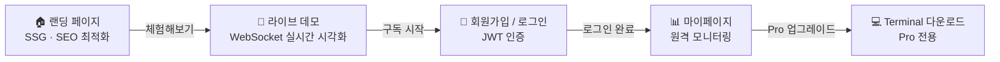

# EarningWhisperer — Frontend


AI 실시간 어닝콜 분석을 체험하고, 구독/결제 후 Trading Terminal을 다운로드하는 SaaS 웹 대시보드입니다.
랜딩·데모 체험·인증·마이페이지·어닝 캘린더·관심종목을 제공하며, 증권사 API 키를 일절 수집하거나 저장하지 않습니다.

---

## 전환 퍼널

서비스의 모든 페이지 설계는 아래 퍼널을 기준으로 합니다.



---

## 페이지 구성

| 페이지 | URL | 인증 | 렌더링 | 설명 |
|--------|-----|------|--------|------|
| 랜딩 | `/` | — | SSG | Hero, Pain Point, How It Works, 요금제 CTA |
| 라이브 데모룸 | `/demo` | — | CSR | WebSocket 실시간 AI 신호 시각화 (게이지, EMA 차트, 신호 피드) |
| 인증 | `/auth` | — | CSR | 로그인 / 회원가입 탭 전환 |
| 마이페이지 | `/mypage` | ✓ | CSR | 거래내역 · 구독관리 · 설정 탭 |
| 관심종목 | `/watchlist` | ✓ | CSR | S&P 500 종목 검색, 추가/삭제 |
| 어닝 캘린더 | `/earnings-calendar` | ✓ | CSR | 관심종목 어닝콜 일정 (90일) + D-day 태그 |
| 다운로드 | `/download` | — | CSR | Trading Terminal 다운로드 안내 (준비 중) |

---

## 주요 화면

### 라이브 데모룸 (`/demo`)

백엔드 `DemoReplayService`가 서버 기동 시부터 과거 어닝콜(예: NVDA Q4 2024)을 무한 반복 재생하는 **라디오 방송국 모델**을 채택합니다. 접속 시점의 재생 구간부터 수신하므로 별도의 세션 관리가 불필요합니다.

```
/topic/live/demo      ← AI 신호 (raw_score, ema_score, action, text_chunk, ...)
/topic/live/demo/price ← 실시간 주가 tick
```

| 컴포넌트 | 역할 |
|---------|------|
| `TensionGauge` | Raw Score / EMA Score 실시간 게이지 |
| `EmaChart` | Recharts 기반 EMA vs Raw 비교 라이브 차트 |
| `SttTextFeed` | 실시간 STT 텍스트 누적 표시 |
| `SignalFeed` | BUY / SELL / HOLD 신호 이력 |
| `PriceTicker` | 현재가 + 등락률 |
| `CtaOverlay` | 미인증 사용자 가입 유도 (blur 레이어) |

WebSocket 연결이 끊기면 3초 후 자동 재연결, 화면 상단에 연결 상태 표시.

### 마이페이지 (`/mypage`)

| 탭 | 구현 내용 |
|----|---------|
| 거래내역 | 테이블(데스크톱) / 카드(모바일) 반응형. ticker, 방향, 수량, 체결 수량, 상태, 일시 |
| 구독관리 | Free / Pro 플랜 비교. 업그레이드 CTA (Toss Payments 준비 중) |
| 설정 | 계정 이메일 표시, 포트폴리오 설정은 Terminal에서 변경 안내, 로그아웃 |

---

## 기술 스택

| 분류 | 기술 | 버전 |
|------|------|------|
| Framework | Next.js (App Router) | 16.2 |
| UI | React | 19 |
| Styling | Tailwind CSS | v4 |
| Animation | Framer Motion | 12 |
| Chart | Recharts | 3 |
| State | Zustand (localStorage persist) | 5 |
| Real-time | SockJS + @stomp/stompjs | — |
| Payment | Toss Payments | (준비 중) |
| Deployment | Vercel | — |

---

## 빠른 시작

### Prerequisites

- Node.js 18+
- 백엔드 서버 실행 중 (기본 `http://localhost:8082`)

### 1. 의존성 설치

```bash
cd frontend
npm install
```

### 2. 환경 변수 설정

`.env.local` 파일을 생성합니다.

```bash
NEXT_PUBLIC_API_URL=http://localhost:8082
NEXT_PUBLIC_WS_URL=http://localhost:8082/ws
```

### 3. 개발 서버 시작

```bash
npm run dev
# → http://localhost:3000
```

### 4. 빌드 및 프로덕션 실행

```bash
npm run build
npm run start
```

---

## 환경 변수

| 변수 | 기본값 | 설명 |
|------|--------|------|
| `NEXT_PUBLIC_API_URL` | `http://localhost:8082` | 백엔드 REST API 기본 URL |
| `NEXT_PUBLIC_WS_URL` | `http://localhost:8082/ws` | WebSocket (STOMP) 연결 주소 |

---

## 인증 플로우

```
로그인 → POST /api/v1/auth/login → accessToken 수신
         → Zustand useAuthStore에 저장 (localStorage persist)
         → 모든 인증 요청 헤더: Authorization: Bearer {accessToken}
```

미인증 상태로 보호 페이지(`/mypage`, `/watchlist`, `/earnings-calendar`) 접근 시 `/auth`로 리다이렉트합니다.

---

## 배포 (Vercel)

Vercel 프로젝트에서 아래 환경 변수를 설정합니다.

```
NEXT_PUBLIC_API_URL=https://your-backend-url
NEXT_PUBLIC_WS_URL=https://your-backend-url/ws
```

랜딩 페이지(`/`)는 `force-static`으로 빌드 타임에 SSG 생성됩니다. 인증이 필요한 페이지는 모두 CSR로 동작합니다.

---

## 관련 문서

| 문서 | 설명 |
|------|------|
| [`docs/api-spec.md`](../docs/api-spec.md) | 서비스 간 API & 데이터 컨트랙트 전체 명세 |
| [`docs/landing-page-ui-spec.md`](docs/landing-page-ui-spec.md) | 랜딩 페이지 UI 컴포넌트 스펙 |
| [`docs/requirements.md`](docs/requirements.md) | 프론트엔드 요구사항 정의서 (원문) |
