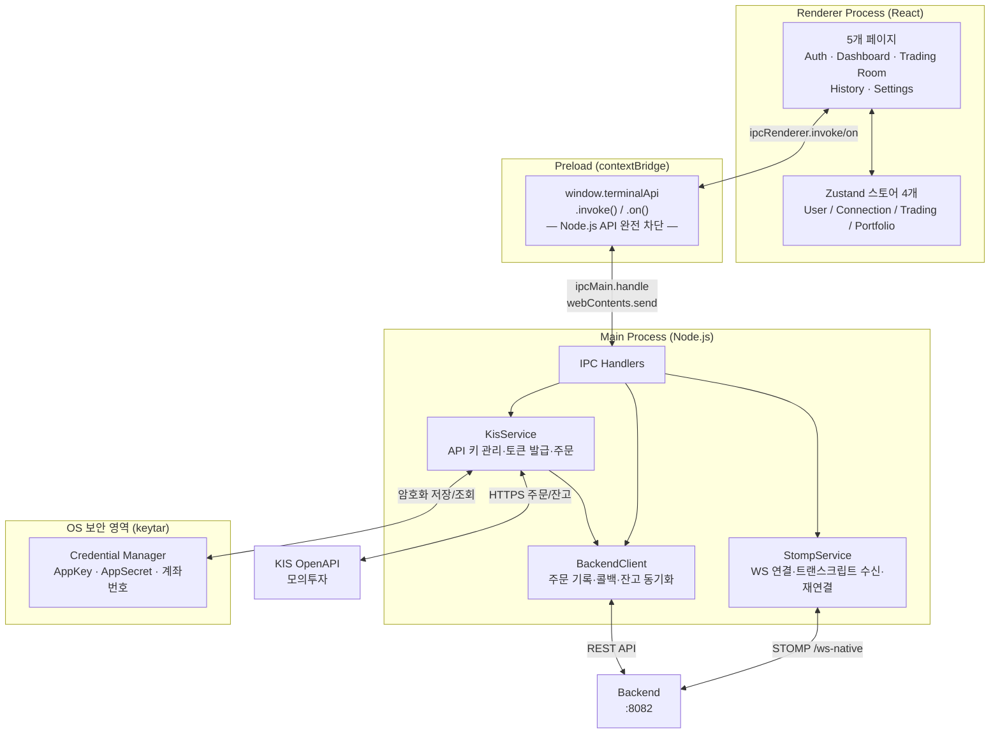
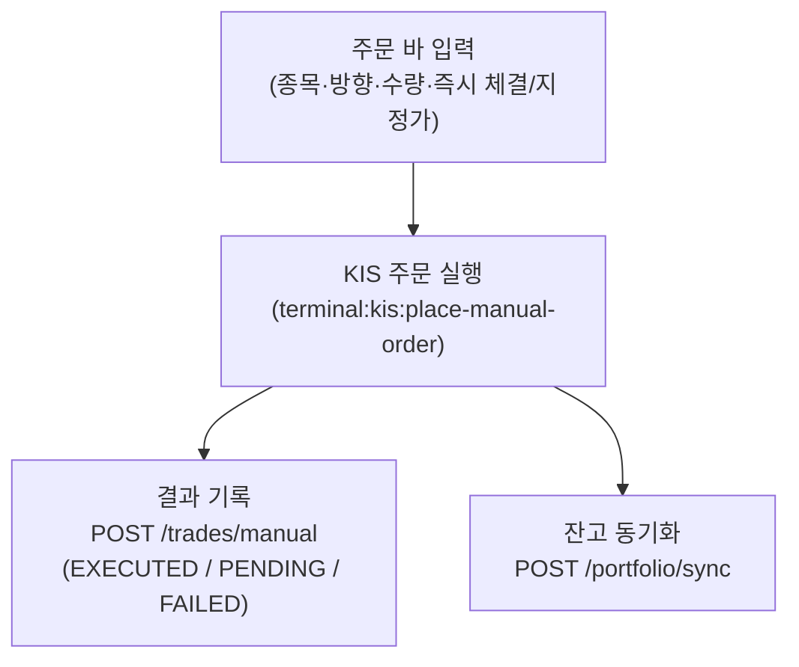

# EarningWhisperer — Trading Terminal


> **KIS API 키는 이 앱의 OS 보안 영역에만 암호화 저장됩니다. 중앙 서버로 절대 전송되지 않습니다.**

어닝콜 분석 결과를 보면서 사용자가 직접 낸 주문을 KIS 계좌로 실행하는 **로컬 실행 엔진(Execution Engine)** 겸 **보안 금고(Vault)**입니다. 자본시장법(미등록 투자일임업 방지) 및 KIS API 약관을 준수하기 위해 모든 주문은 사용자의 로컬 PC에서 직접 실행됩니다.

---

## 보안 아키텍처


```mermaid
graph TB
    subgraph Renderer["Renderer Process (React)"]
        UI["5개 페이지\nAuth · Dashboard · Trading Room\nHistory · Settings"]
        Stores["Zustand 스토어 4개\nUser / Connection / Trading / Portfolio"]
        UI <--> Stores
    end

    subgraph Preload["Preload (contextBridge)"]
        Bridge["window.terminalApi\n.invoke() / .on()\n— Node.js API 완전 차단 —"]
    end

    subgraph Main["Main Process (Node.js)"]
        IPC["IPC Handlers"]
        KisSvc["KisService\nAPI 키 관리·토큰 발급·주문"]
        StompSvc["StompService\nWS 연결·트랜스크립트 수신·재연결"]
        BackendSvc["BackendClient\n주문 기록·콜백·잔고 동기화"]
        IPC --> KisSvc & StompSvc & BackendSvc
        KisSvc --> BackendSvc
    end

    subgraph Secure["OS 보안 영역 (keytar)"]
        Vault["Credential Manager\nAppKey · AppSecret · 계좌번호"]
    end

    UI <-->|"ipcRenderer.invoke/on"| Bridge
    Bridge <-->|"ipcMain.handle\nwebContents.send"| IPC
    KisSvc <-->|"암호화 저장/조회"| Vault
    KisSvc <-->|"HTTPS 주문/잔고"| KIS["KIS OpenAPI\n모의투자"]
    StompSvc <-->|"STOMP /ws-native"| Backend["Backend\n:8082"]
    BackendSvc <-->|"REST API"| Backend
```

**핵심 보안 원칙:**
- Renderer Process는 `fs`, `path`, Node.js API에 직접 접근할 수 없습니다.
- KIS API 키는 `keytar`를 통해 OS Credential Manager에 암호화 저장되며, 조회 시마다 OS에서 복호화합니다. 메모리에 캐시하지 않습니다.
- 모든 민감 작업(주문, API 키 복호화)은 Main Process에서만 실행됩니다.

---

## 주문 방식

주문은 사용자가 Trading Room 하단 주문 바에서 직접 입력한 수동 주문만 있습니다. 백엔드가 보낸 매매 신호로 주문하던 경로와 매매 모드 선택은 #127 에서 제거했습니다.


```mermaid
flowchart TD
    Order["주문 바 입력\n(종목·방향·수량·즉시 체결/지정가)"]
    Order --> Execute["KIS 주문 실행\n(terminal:kis:place-manual-order)"]
    Execute --> Record["결과 기록\nPOST /trades/manual\n(EXECUTED / PENDING / FAILED)"]
    Execute --> Sync["잔고 동기화\nPOST /portfolio/sync"]
```

---

## 기술 스택

| 분류 | 기술 | 버전 |
|------|------|------|
| 데스크톱 프레임워크 | Electron | 31 |
| UI | React | 18 |
| 스타일링 | Tailwind CSS | v3 |
| 빌드 도구 | electron-vite | 2 |
| 패키징 | electron-builder | 24 |
| 상태 관리 | Zustand | 4 |
| 보안 저장소 | keytar (OS Credential Manager) | 7 |
| HTTP 클라이언트 | axios | 1.7 |
| WebSocket (Main) | @stomp/stompjs + ws | — |
| 차트 | lightweight-charts | 4 |
| 언어 | TypeScript | 5 |

---

## 빠른 시작

### Prerequisites

- Node.js 18+
- Python & C++ 빌드 도구 (keytar 네이티브 모듈 컴파일 필요)
  - **Windows:** Visual Studio Build Tools + `windows-build-tools`
  - **macOS:** Xcode Command Line Tools (`xcode-select --install`)
- 백엔드 서버 실행 중 (기본 `http://localhost:8082`)
- KIS 모의투자 계좌 및 API 키 ([KIS Developers](https://apiportal.koreainvestment.com) 발급)

### 1. 의존성 설치

```bash
cd trading-terminal
npm install
# postinstall 스크립트가 자동으로 keytar 네이티브 모듈을 컴파일합니다
# electron-rebuild -f -w keytar
```

### 2. 환경 변수 설정 (선택)

`BACKEND_URL` 기본값은 `http://localhost:8082`입니다. 변경하려면:

```bash
# .env 파일 생성
BACKEND_URL=http://your-backend-server:8082
```

### 3. 개발 모드 실행

```bash
npm run dev
```

Vite 개발 서버와 Electron이 동시에 시작되며, 소스 변경 시 자동 리로드됩니다.

---

## 빌드 및 패키징

```bash
# TypeScript + React 빌드
npm run build

# 최종 설치 파일 생성 (build → electron-builder)
npm run package
```

| 플랫폼 | 출력 파일 |
|--------|---------|
| Windows | `dist/EarningWhisperer Terminal Setup 0.1.0.exe` |
| macOS | `dist/EarningWhisperer Terminal-0.1.0.dmg` |

빌드 중간 산출물은 `out/`에 생성됩니다.

---

## 페이지 구성

| 페이지 | 경로 | 역할 |
|--------|------|------|
| 인증 & Vault | `/auth` | JWT 로그인 + KIS API 키 OS 암호화 저장 (2-Step) |
| 대시보드 | `/dashboard` | 포트폴리오 현황(잔고·보유 종목) + 어닝콜 일정 |
| 트레이딩 룸 | `/trading-room` | **핵심** — 실시간 트랜스크립트 · 팩트체크 · 종합 판단 + 수동 주문 |
| 체결 내역 | `/history` | 페이지네이션된 체결 내역 테이블 |
| 설정 | `/settings` | KIS 연동 상태 + 모의/실전 전환 |

---

## IPC 채널 레퍼런스

### Renderer → Main (`ipc.invoke`)

| 채널 | 역할 |
|------|------|
| `terminal:auth:login` | 백엔드 JWT 로그인 |
| `terminal:auth:logout` | 로그아웃 + 민감 데이터 소거 |
| `terminal:vault:save-credentials` | KIS API 키 OS Credential Manager에 저장 |
| `terminal:vault:has-credentials` | KIS API 키 저장 여부 확인 |
| `terminal:vault:delete-credentials` | KIS API 키 삭제 |
| `terminal:kis:get-balance` | KIS 잔고 조회 (해외주식) |
| `terminal:kis:place-manual-order` | 수동 주문 실행 + 결과 기록 |
| `terminal:kis:get-token-status` | KIS OAuth 토큰 상태 조회 |
| `terminal:kis:issue-token` | KIS OAuth 토큰 발급 |
| `terminal:ws:connect` | 백엔드 STOMP 연결 시작 |
| `terminal:ws:disconnect` | 백엔드 STOMP 연결 해제 |
| `terminal:trades:get` | 체결 내역 페이지네이션 조회 |

### Main → Renderer (`ipc.on`)

| 채널 | 역할 |
|------|------|
| `terminal:trade:executed` | 주문 체결 성공 결과 |
| `terminal:trade:failed` | 주문 실패 결과 |
| `terminal:ws:status-changed` | WebSocket 연결 상태 변화 |
| `terminal:kis:token-refreshed` | KIS 토큰 자동 갱신 완료 |

---

## KIS API 주요 정보

**모의투자 베이스 URL:** `https://openapivts.koreainvestment.com:29443`

| 작업 | TR_ID |
|------|-------|
| 해외주식 매수 | `VTTT1002U` |
| 해외주식 매도 | `VTTT1006U` |

**토큰 관리 전략:** 발급 후 Main Process 메모리 캐싱 → 만료 1시간 전 선제 갱신 → 갱신 실패 시 알림

---

## 환경 변수

| 변수 | 기본값 | 설명 |
|------|--------|------|
| `BACKEND_URL` | `http://localhost:8082` | 백엔드 REST API + WebSocket 서버 주소 |

WebSocket URL은 `BACKEND_URL`에서 자동 파생됩니다: `http://...` → `ws://.../ws-native`

---

## 관련 문서

| 문서 | 설명 |
|------|------|
| [`docs/api-spec.md`](../docs/api-spec.md) | 서비스 간 API & 데이터 컨트랙트 전체 명세 |
| [`docs/developer/architecture.md`](../docs/developer/architecture.md) | 시스템 구성과 터미널 프로세스 구조 |
| [`docs/install/desktop-app.md`](../docs/install/desktop-app.md) | 설치본 설치와 업데이트 |
| [`docs/features/`](../docs/features/) | 기능별 사용 안내 |
